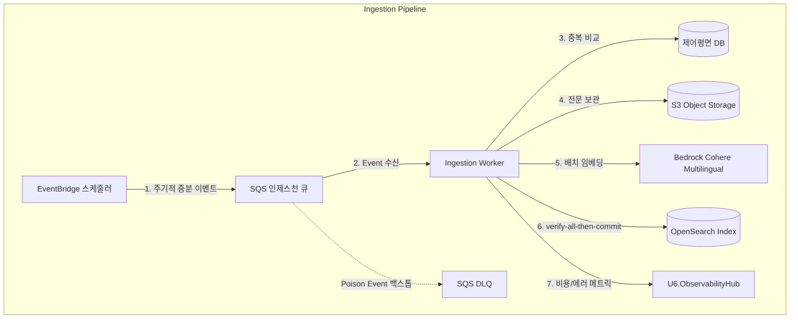

# logical-components.md — 논리 컴포넌트 설계 및 토폴로지

**단계**: CONSTRUCTION → NFR Design (U1) · **유닛**: U1 Ingestion · **일자**: 2026-06-16
**근거**: `u1-ingestion-nfr-design-plan.md` 승인 답변 · `nfr-requirements.md` · `business-rules.md`
**상태**: 확정 (계획 게이트 승인 완료)

---

## 0. U1 Corpus 논리 컴포넌트 우선 적용 개정 (2026-06-26)

> **우선순위**: 본 섹션은 U1 Corpus 재인셉션의 최신 NFR Design이다. 아래 §1~§5의 arXiv-only, Cohere v3, 단일 `Watermark`, `Chunker`, `VectorIndexWriter` 설명과 충돌하면 **본 섹션을 우선한다**. 기존 섹션은 과거 결정과 멀티모달 자산 설계 추적으로 보존한다.

### 0.1 Corpus component topology

| 논리 컴포넌트 | 역할 | 상태/저장 |
|---|---|---|
| **EventBridge Source Scheduler** | source별 incremental/seed/backfill/rebuild job 발행. arXiv, Semantic Scholar, OpenAlex watermark를 분리한다. | schedule config |
| **Corpus Work Queue** | source page/item을 worker에 전달. stage retry와 reprocess job도 같은 envelope를 쓴다. | SQS |
| **Corpus DLQ** | retry 소진 또는 permanent failure 격리. stage, sourceName, paperId/version, failureReason을 보존한다. | SQS DLQ |
| **Ingestion Worker** | source fetch, license validate, GROBID/HTML extraction, canonical dedup, eager DocModel, Block chunk, embed, generation write를 오케스트레이션한다. | stateless compute |
| **Internal GROBID Runtime** | Semantic Scholar/OpenAlex PDF와 arXiv PDF fallback을 TEI/structure로 추출한다. 외부 공개 endpoint가 아니다. | container/service/sidecar; Infra에서 배치 |
| **DocModel Parser** | arXiv HTML/MathML과 GROBID TEI를 공통 DocModel schema로 변환한다. LLM extraction 없음. | stateless library |
| **Control Plane DB** | source watermark, canonical dedup state, generation state, parser/chunker version, job item state를 저장한다. | existing Postgres 우선 |
| **Private Corpus S3** | normalized FullText, DocModel JSON, assets, generation manifest 저장. raw PDF 저장 금지. | S3 private SSE |
| **Bedrock Cohere Embed v4** | DocModelChunk embedding. active VectorSpec은 `specVersion=v2`, dimensions=1024, cosine이다. | Bedrock |
| **OpenSearch Generation** | DocModel Block 기반 vector+lexical index generation. active alias 밖에서 검증 후 cutover한다. | OpenSearch |
| **U6 ObservabilityHub** | source watermark lag, GROBID failure, DocModel validation failure, embedding spend, DLQ backlog, cutover status metric/log 수집. | `emitMetric`/`emitLog` |

### 0.2 FD component mapping

| U1 Corpus FD 컴포넌트 | NFR Design 논리 컴포넌트 |
|---|---|
| `CorpusSourceAdapterSet` | Ingestion Worker + source별 HTTP adapter + Source Scheduler |
| `FullTextExtractionProcessor` | Ingestion Worker + Internal GROBID Runtime + DocModel Parser input hardening |
| `SourcePriorityDeduplicationGuard` | Ingestion Worker + Control Plane DB canonical dedup state |
| `DocModelBuildCoordinator` | Ingestion Worker + DocModel Parser + Private Corpus S3 |
| `DocModelBlockChunker` | Ingestion Worker stateless library |
| `EmbeddingGatewayAdapter` | Ingestion Worker + Bedrock Cohere Embed v4 |
| `CorpusIndexWriter` | Ingestion Worker + OpenSearch Generation + active alias |
| `CorpusRefreshScheduler` | EventBridge Source Scheduler + Control Plane DB source watermarks |
| `IngestFailureHandler` | Ingestion Worker + Corpus Work Queue + Corpus DLQ + ObservabilityHub |

### 0.3 Control-plane state changes

| State | Key | Rule |
|---|---|---|
| **SourceWatermark** | `(sourceName)` | source별 단조 증가. page/item이 commit/retry/DLQ로 명시 상태를 가진 뒤 전진. |
| **CanonicalDedupState** | `(canonicalKey)` | DOI -> arXiv id -> normalized title/firstAuthor/year 순서. losing source는 provenance만 저장. |
| **PaperVersionState** | `(paperId, version)` | DocModel, chunk, index, S3 manifest 정합 검사. |
| **IndexGenerationState** | `(generationId)` | `BUILDING` -> `VALIDATED` -> `ACTIVE` -> `ROLLED_BACK/RETIRED`. |
| **DLQReprocessState** | `(dlqItemId)` | reprocess 반복이 중복 artifact/index record를 만들지 않도록 attempt와 canonical fingerprint 보존. |

### 0.4 Internal-only boundaries

- GROBID는 내부 worker network에서만 호출한다. 사용자 업로드 PDF, 공개 GROBID endpoint, raw PDF 다운로드는 없다.
- OpenSearch generation alias cutover는 운영/worker 권한만 가능하다. U2는 active alias reader이며 generation write 권한이 없다.
- Control Plane DB의 source provenance와 object refs는 내부 데이터다. 사용자 응답에는 signed URL/문서 anchor만 노출한다.

---

## 1. 논리 컴포넌트 정의 및 역할

U1 Ingestion 유닛은 대규모 비동기 처리를 담당하며, 논리적으로 다음과 같은 7개 핵심 컴포넌트로 구성됩니다.



### 1.1 컴포넌트 목록
1. **EventBridge Scheduler**: 일 1회 증분 수집 이벤트를 발행하는 논리 스케줄러입니다(프로토콜은 NFR Requirements §1 고정: 시드=대량 하베스트, 증분=fetchMetadataPage).
2. **SQS Ingestion Queue & DLQ**:
   * **Ingestion Queue**: 수집된 arXiv ID 및 메타데이터 이벤트를 담는 버퍼 큐입니다.
   * **Poison DLQ**: 처리 불가하거나 재시도 횟수를 초과한 불량 이벤트를 격리하여 모니터링하기 위한 대기열입니다.
3. **Ingestion Worker (컴퓨트)**:
   * SQS에서 이벤트를 컨슈밍하여 파싱, 중복 체크, 전문 다운로드, 임베딩, 인덱싱을 오케스트레이션하는 주체입니다.
4. **제어평면 상태 저장소 (Control Plane State Store)**:
   * **지정 패턴**: 타 유닛(U3/U4)에서 PostgreSQL/Aurora를 사용할 경우 데이터스토어 sprawl을 회피하기 위해 **Postgres DB 우선 재사용**, RDS가 없을 경우 서버리스 **DynamoDB**를 사용합니다.
   * **저장 정보**: `REBUILD_LOCK`(작업 락), `Watermark`(최종 수집 시간), `DedupState`(논문별 해시 지문 및 버전).
5. **S3 Object Storage**: 공개가 차단된 전용 버킷에 파싱된 논문의 전문 텍스트 및 메타데이터 JSON을 보존합니다 (SEC-9).
6. **Bedrock Cohere Multilingual v3**: 한국어/영어 교차 언어 임베딩 매핑을 지원하는 임베딩 엔진입니다.
7. **OpenSearch Index**: 벡터 검색을 지원하며 k-NN 인덱스가 활성화된 1024차원 코사인 거리 기반의 메인 코퍼스 저장소입니다.

---

## 2. 기능 설계(Functional Design) 매핑

U1 기능 설계(FD)의 **실제 9개 컴포넌트 + 3개 서비스**(business-logic-model.md §1-2)가 논리 컴포넌트에 매핑된다. **§1의 7개 박스는 배포되는 논리 인프라 토폴로지**이고, FD의 9+3은 그 안의 단일 물리 **Ingestion Worker**(모듈형 모놀리스 워커)에 공존하는 도메인 단위다 — 둘은 서로 다른 관점이며 재계수가 아니다.

| FD 컴포넌트 / 서비스 (실제 명칭) | NFR Design 논리 컴포넌트 매핑 | 관리 항목 / 상태 위치 |
| :--- | :--- | :--- |
| **IngestionPipelineService** _(서비스)_ | Ingestion Worker — `ingestOne` 오케스트레이터 | 논문 단위 파이프라인 제어(INV-1) |
| **RefreshOrchestrationService** _(서비스)_ | Ingestion Worker 제어평면(3 진입점 분배) + 제어평면 DB | `REBUILD_LOCK` |
| **IngestionResilienceService** _(서비스)_ | Ingestion Worker resilience 횡단 + SQS DLQ | 재시도/서킷/DLQ 정책 |
| **ArxivSourceClient** | Ingestion Worker (arXiv HTTP 호출부 + 레이트 리미터) | 외부 arXiv 연결(stateless) |
| **FetchParseProcessor** | Ingestion Worker (parse/validate + OA 라이선스 검증) | 로컬 메모리(stateless) |
| **Chunker** | Ingestion Worker (결정적 섹션 청킹) | 로컬 메모리(stateless) |
| **EmbeddingGatewayAdapter** | Ingestion Worker + Bedrock Cohere v3 | 배치 임베딩 클라이언트 |
| **VectorIndexWriter** | Ingestion Worker + OpenSearch | `_bulk`/tombstone, `indexStats` |
| **DeduplicationGuard** | Ingestion Worker + 제어평면 DB | `DedupState` (Postgres / DynamoDB) |
| **RefreshScheduler** | EventBridge Scheduler + 제어평면 DB | `Watermark`(증분 트리거·max-clamp) |
| **NewArxivEventHandler** | Ingestion Worker (SQS 컨슈머) | `ackEvent`, poison→DLQ (BR-12) |
| **IngestFailureHandler** | Ingestion Worker + SQS DLQ | classify/scheduleRetry/sendToDLQ/emitFailureSignal |

---

## 3. 제어평면 상태 관리 상세 (Control Plane State)

제어평면 DB에 저장될 비기능 상태 항목들은 다음과 같이 설계됩니다.

### 3.1 Concurrency Manager (`REBUILD_LOCK`)
* **역할**: 대규모 재구축과 일시적 증분 수집이 동시에 진행되지 않도록 상호 배제(Mutual Exclusion)합니다.
* **설계**:
  * **Postgres 구현 시**: pg_advisory_xact_lock(재구축용 세션 락) 또는 전용 락 행(`LOCK_KEY='REBUILD'`)에 대한 `SELECT FOR UPDATE`를 사용합니다.
  * **DynamoDB 구현 시**: `REBUILD_LOCK` 파티션 키에 대해 낙관적 락(`attribute_not_exists`)을 이용한 조건부 쓰기(Conditional Write)를 사용합니다.

### 3.2 Watermark Store (`Watermark`)
* **역할**: 마지막으로 성공적으로 수집 완료한 arXiv 논문의 타임스탬프를 관리하여 중복 수집 범위를 제한합니다.
* **설계**: `last_successful_timestamp` 단일 칼럼/속성을 유지하며, 각 논문 전체 청크 인덱싱이 verify-all로 완전 검증 완료되었을 때만 갱신합니다.

### 3.3 Deduplication Guard & 버전 단조 가드 (`DedupState`)
* **역할**: 중복 임베딩 배제(NFR-C1 비용 절감) **+ 버전 단조 순서 가드**(BR-14 highest-vN-wins).
* **설계**:
  * 테이블 구조: `paper_id` (PK), **`current_version`** (현재 적용된 최고 arXiv 버전), **`state`** (`INDEXED` \| `TOMBSTONED`), `semantic_hash` (본문 SHA-256), `ingested_at`.
  * **`isNew(paper_id, semantic_hash)`**: 해시 부재 또는 신규 버전 시 `True` — **인서트 스킵 판정 전용**(삭제 가드 아님).
  * **버전 단조 compare-and-set (인서트·삭제 공통 가드, BR-14)**: 모든 적용은 `current_version`에 대한 **원자적 조건부 쓰기**로 가드한다 — `upsert(vN)`는 `vN >= current_version`, `tombstone(vW)`는 `vW >= current_version`일 때만 적용하며 `current_version`(+`state`)을 갱신; **`current_version > vW`면 삭제 무시**(strictly-newer-vN-wins). 구현: Postgres `... WHERE current_version <= :v`(또는 advisory-lock) / DynamoDB 조건부 표현식. 도착 순서 무관 수렴.

---

## 4. 데이터플레인 헬스/통계 인터페이스 (`indexStats` 소비 계약)

RES-6 복원력 및 RES-2 재구축 검증을 위해, U1은 데이터플레인 헬스/통계 **소비 계약** `indexStats`를 제공하고 **U6.HealthCheckService.deepCheck가 이를 소비**합니다. (U1은 비동기 워커 — HTTP 서비스가 아니므로 REST 라우트가 아님.)

* **계약(FD §5)**: `indexStats() -> IndexStats{ docCount, vectorCount, lastWrite }` — U6.HealthCheckService.deepCheck 소비(RES-6) · RES-2 재구축 완전성 검증.
* **노출 메커니즘(동기 프로브 / 메트릭 / 풀 RPC)은 Infra/Ops** — 워커 프로세스 liveness 프로빙 보류(Q14)와 정합.
* **접근 경계 (SEC-7/8/9)**: **내부 전용** — 공개 인그레스 금지(deny-by-default, SEC-7). **U6.HealthCheckService만** 내부망 + 서비스 인증(IAM/mTLS)으로 접근하도록 강제(구체 네트워크/정책은 Infra). `docCount`·`lastWrite`·의존성 상태는 **운영 내부 정보**이므로 외부 비노출(권한 없는 리소스 접근 차단 SEC-8, 하드닝 SEC-9). REST 라우트로 공개하지 않음.
* **카운트 비용 (헬스체크가 부하가 되지 않도록)**: deepCheck 폴링이 **매 호출 OpenSearch 실시간 집계(`count`)를 때리지 않게** 한다 — 대규모 인덱스의 정확 count는 비싸다. **캐시된 통계(명시 TTL, 예: 60s) 또는 근사 카운트** 사용; `lastWrite`는 제어평면(저비용) 출처, `docCount`/`vectorCount`는 주기 스냅샷/근사값. TTL·갱신 주기는 Infra/Ops 확정.
* **IndexStats 예시 형상**(illustrative):
```json
{
  "status": "HEALTHY",
  "timestamp": "2026-06-16T12:50:00Z",
  "index_name": "corpus-index-v1",
  "metrics": {
    "total_documents": 234500,
    "vector_count": 234500,
    "last_write_timestamp": "2026-06-16T12:45:12Z"
  },
  "dependencies": {
    "opensearch": "UP",
    "control_plane_db": "UP",
    "bedrock_embedding": "UP"
  }
}
```
* **의의**: 단순 프로세스 liveness(UP/DOWN) 체크를 넘어, 벡터 인덱스의 실제 문서 수와 마지막 쓰기 시점을 실시간 확인하여 복원 성능과 데이터 정합성이 유지되고 있는지 능동적으로 감시합니다.

---

---

## 5. 멀티모달 자산 컴포넌트 (FR-17 — 표시 전용, 2026-06-22 확장)

> 근거: FD §6/§7 · TD-11~15 · NFR Design 계획 Q1~Q5=A. **§1~4 기존 토폴로지(EventBridge·SQS·Worker·OpenSearch·Bedrock)·제어평면 상태 불변** — 자산은 인덱스 경로와 독립.

### 5.1 신규 논리 컴포넌트 (Q1=A — Worker 내 stateless)

```mermaid
graph TD
    Worker[Ingestion Worker] -->|parse 산출 raw/parsed| AX[AssetExtractor]
    AX -->|e-print 그래픽 / PDF 크롭| NORM[Image Normalizer<br/>WebP·치수상한·메타스트립]
    NORM -->|자산 바이너리| S3A[(S3 자산 prefix<br/>private·SSE)]
    NORM -->|자산 메타| AS[AssetStore]
    AS -->|매니페스트 행 upsert| RDS[(공유 RDS PostgreSQL<br/>paper_asset)]
    AX -.->|실패 ASSET_*| Obs[U6.ObservabilityHub]
    Worker -.->|인덱스 경로(불변)| OS[(OpenSearch)]
```

| 컴포넌트 | 역할 | 상태/저장 |
|---|---|---|
| **AssetExtractor** | `parse` 산출(raw/parsed)에서 그림·도표 디스커버리. **혼합(BR-23)**: e-print(LaTeX) 그래픽 직접 추출 / 없으면 PDF page-crop 폴백(PyMuPDF, TD-11). 캡션 정규식 근접 매칭(§7.1). stateless. | 로컬 메모리 |
| **Image Normalizer** | 안전 디코더 재디코드 → 다운스케일/픽셀 상한 → WebP 재인코딩 → 메타 스트립(TD-13/15, §7.2). | 로컬 메모리 |
| **AssetStore** | 바이너리=S3 자산 prefix(`PutObject`), 매니페스트/메타=공유 RDS(`paper_asset`). `replace_assets`(CHANGED)·`remove_assets`(tombstone). 정합 write-order(§7.4). | S3 + RDS |

- **배치/동시성(Q1=A)**: 단일 물리 **Ingestion Worker**(모듈형 모놀리스)에 공존하는 도메인 컴포넌트(§2 매핑과 동형). 인덱스 경로(chunk/embed/upsert)와 **독립**이라 best-effort·비차단(BR-27). 별도 서비스·큐 없음.

### 5.2 자산 매니페스트 상태 (`paper_asset`, RDS — Q5=A, TD-14)

* **역할**: 표시 진실원천(U7 full-text/paper API가 조회 → S3 서명 URL 발급). 매니페스트↔S3 자산 정합(P8).
* **설계**: 공유 RDS PostgreSQL 테이블.
  * 키: `(paper_id, version, asset_id)`. 컬럼: `type`(figure|table)·`caption`·`section_ref`·`ordinal`·`source_mode`(structured|page-crop)·`object_ref`(S3 키)·`page_ref`·`bbox`·`created_at`.
  * **write-order 정합(§7.4)**: S3 `PutObject` 성공 → RDS 행 upsert. (고아 S3 객체는 허용·GC; "행 있는데 객체 없음" = 깨진 표시 → 회피.)
  * **CHANGED(vN↑)**: 새 version 행·객체 교체 후 이전 version 정리. **tombstone**: 행·객체 삭제.
  * 스키마·마이그레이션·인덱스 구체는 Infra Design.
* **접근 경계(SEC-8/9)**: owner 개념 없는 공개 코퍼스 자산이나, `object_ref`·내부 메타는 비노출 — 외부 노출은 U7이 서명 URL로만.

> **추적성**: 패턴↔요구사항 매트릭스는 `nfr-design-patterns.md` §6/§7 참조. 본 문서는 컴포넌트별 ID를 인라인 인용(SEC-9·RES-6·RES-2·NFR-C1·BR-9/13/14·BR-22~28).
