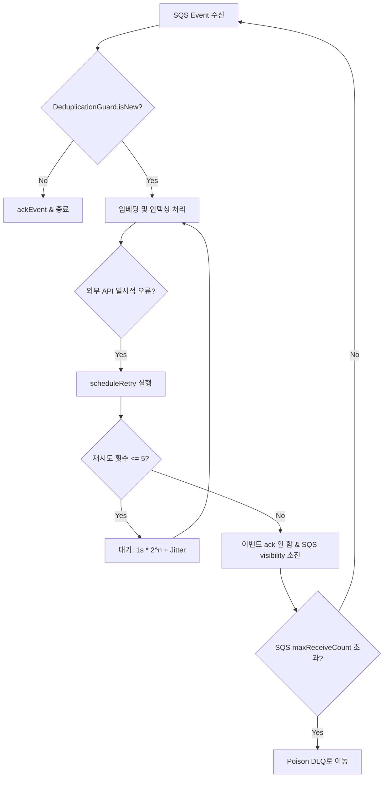

# u1-ingestion-nfr-design-patterns.md — 비기능 설계 패턴

**단계**: CONSTRUCTION → NFR Design (U1) · **유닛**: U1 Ingestion · **일자**: 2026-06-16
**근거**: `u1-ingestion-nfr-design-plan.md` 승인 답변 · `nfr-requirements.md` · `business-rules.md`
**상태**: 확정 (계획 게이트 승인 완료)

---

## 0. U1 Corpus NFR 패턴 우선 적용 개정 (2026-06-26)

> **우선순위**: 본 섹션은 U1 Corpus 최신 NFR Design이다. 아래 §1~§7의 arXiv-only, Cohere v3, 단일 watermark, legacy chunk/index 설명과 충돌하면 **본 섹션을 우선한다**.

### 0.1 Stage-aware retry/DLQ pattern

| Stage | Retriable | Permanent/DLQ | Notes |
|---|---|---|---|
| `source_fetch` | timeout, 429, 5xx | 404/source gone | source별 quota와 circuit breaker 적용 |
| `license_validate` | license service transient failure | non-OA/not indexing-allowed | raw PDF/FullText 저장 전 차단 |
| `grobid_extract` | GROBID timeout/5xx/capacity | malformed PDF after retries | raw PDF는 retry 중에도 durable 저장하지 않음 |
| `docmodel_validate` | parser transient/runtime failure | schema invalid, missing required block ids | index write 전 blocker |
| `embed` | Bedrock timeout/429/5xx | repeated unsupported payload | cost metric 필수 |
| `index_write` | OpenSearch 429/5xx/partial bulk | mapping/schema mismatch | generation alias 전환 금지 |
| `artifact_store` | S3/DB timeout/5xx | checksum/schema violation | `(paperId, version)` manifest 정합 검증 |

- DLQ item은 `sourceName`, `stage`, `paperId?`, `version?`, `canonicalKey`, `attempts`, `failureReason`을 보존한다.
- Reprocess는 별도 보정기를 만들지 않고 동일 canonical pipeline으로 재진입한다.

### 0.2 Source-specific circuit breaker pattern

| Dependency | Circuit scope | OPEN behavior |
|---|---|---|
| arXiv | sourceName=`ARXIV` | arXiv fetch 신규 item 보류. 다른 source는 계속 처리. |
| Semantic Scholar | sourceName=`SEMANTIC_SCHOLAR` | 해당 source fetch 보류. existing DLQ/retry backoff 유지. |
| OpenAlex | sourceName=`OPENALEX` | 해당 source fetch 보류. |
| GROBID | extraction pool | PDF extraction item 보류/retry. HTML arXiv path는 계속 처리. |
| Bedrock Embed v4 | embedding | 신규 embed batch 보류. active index read path 영향 없음. |
| OpenSearch generation | generationId | write 차단, alias cutover 금지, active alias 유지. |

### 0.3 Cost hard-stop pattern

- U1 Corpus job은 `$1600/month` account/app budget 안에서 별도 run budget을 가진다.
- budget state가 warning이면 low-priority backfill을 늦추고, hard stop이면 신규 source fetch/GROBID/embed/index work를 중단한다.
- hard stop은 active alias, existing DocModel read, existing search를 삭제/저하하지 않는다. 새 Corpus 확장만 보류한다.
- metric 단위: `source_fetch_count`, `grobid_document_count`, `docmodel_count`, `chunk_count`, `embedding_vector_count`, `embedding_token_estimate`, `opensearch_bulk_items`, `s3_bytes_written`.

### 0.4 Generation cutover/rollback pattern

| Gate | Requirement |
|---|---|
| Schema gate | DocModel `fullText` + paragraph/table/formula/figure/list/code block schema roundtrip and negative validation pass. |
| BlockRef gate | Every CorpusIndexRecord `blockRefs[]` exists in its DocModel. |
| AssetRef gate | Every figure/table `AssetRef` in DocModel resolves to an allowed private `assets/` object or explicit degraded fallback. |
| Version gate | FullText, DocModel, chunks, S3 manifest, index records share `(paperId, version)`. |
| Count gate | generation doc/chunk counts are within expected phase-1 bounds. |
| Smoke gate | U2 search smoke and U7 DocModel read smoke pass against candidate generation. |
| Cutover | OpenSearch alias switch is atomic from reader perspective. |
| Rollback | Keep previous generation until cutover burn-in completes. |

### 0.5 Parser hardening pattern

- HTML/XML/TEI parsing disables external entity resolution and external DTD loading.
- Parser enforces input size and block count limits before materializing DocModel.
- Parser materializes `fullText` as a projection, not as a second source of truth; structured blocks remain authoritative for tables, formulas, figures, lists, and code.
- Raw source markup is not rendered directly. DocModel is normalized data, and U5/U7 render trusted components.
- GROBID output is untrusted input and must pass the same DocModel schema validation as arXiv HTML output.

### 0.6 QT-9 verification pattern

| Invariant | Minimal check |
|---|---|
| multisource dedup idempotency | Property test with shuffled/duplicated DOI/arXiv/title-key records. |
| source watermark monotonicity | Property test for per-source advance and rejected regression. |
| `(paperId, version)` consistency | Unit/property test over generated manifests/chunks/index records. |
| DocModel validation | Schema roundtrip + negative cases for missing `fullText`, missing/duplicate block ids, invalid SourceTier, invalid table rows, invalid formula payload, and unresolved AssetRef. |
| index blockRef existence | Build index records from generated DocModel and assert every ref resolves. |
| retry/DLQ idempotency | Replay same DLQ item N times and assert no duplicate artifacts/index records. |
| raw PDF non-storage | PDF path fake store assertion: no artifact key/contentType represents raw PDF. |

### 0.7 Traceability

| Pattern | Requirements |
|---|---|
| Stage-aware retry/DLQ | RES-7/8/9, US-I3, QT-9 |
| Source-specific circuit breaker | RES-8/9, NFR-R1 |
| Cost hard-stop | NFR-C1, RES-11(a) |
| Generation cutover/rollback | NFR-R1, RES-2, QT-9 |
| Parser hardening | SEC-5/9/15, C-1 |
| QT-9 verification | QT-9, PBT-02/03/07/08/09 |

---

## 1. 복원력 패턴 (Resilience Patterns)

### 1.1 재시도 및 DLQ 백스톱 패턴 (RES-9 / BR-12 / BR-16)
비동기 인제스천 과정에서 발생하는 외부 의존성 오류 및 일시적 장애를 해결하기 위해 2단계 재시도 전략을 도입합니다.



* **앱 레벨 `scheduleRetry` (RES-9 엔벨로프)**:
  * 외부 API 호출(arXiv, Bedrock, OpenSearch 등) 실패 시 앱 내부에서 재시도를 처리합니다.
  * **설정**: 최대 재시도 횟수 $5$회, 타임아웃 $10$초, 기본 대기 시간 $1$초, 지수 백오프(배수 $2$), 무작위 지터(Jitter)를 적용합니다.
* **SQS Redrive 및 DLQ 백스톱**:
  * 앱 레벨 재시도가 완전히 소진되거나, 복구 불가능한 시스템 오류(Poison Event 등) 발생 시 SQS의 `maxReceiveCount` 임계값을 통해 SQS DLQ(Dead Letter Queue)로 메시지를 안전하게 격리합니다.
* **이벤트 멱등성 (BR-12)**:
  * 이벤트 중복 수신 시 `DeduplicationGuard.isNew` 단일 백스톱을 통해 이미 처리된 이벤트는 중복 처리 없이 `ackEvent`를 호출하고 즉시 처리를 종료합니다.

### 1.2 의존성별 서킷 브레이커 및 정의된 저하 (RES-1 / RES-9)
외부 의존성이 다운되었을 때 시스템 전반으로 장애가 전파되는 것을 차단하고 우아하게 성능을 저하(Graceful Degradation)합니다.

| 의존 대상 | 장애 감지 기준 | 장애 시 저하 행동 (Degradation Behavior) | 추적 ID |
| :--- | :--- | :--- | :--- |
| **arXiv API** | 연속 3회 타임아웃(10s) 또는 5xx 에러 | 신규 논문 수집(Job)을 보류하고 알림을 발행하되, 기존 큐에 적재된 논문의 파싱/임베딩은 정상 진행 | RES-1, RES-9 |
| **Bedrock (Cohere)** | API Throttle(429) 또는 연속 3회 에러 | 임베딩 배치를 일시 보류하고 앱 레벨 백오프 재시도 수행. 지속 실패 시 수집 이벤트를 큐에 유지(Visibility 만료 후 재시도) | RES-1, RES-9 |
| **OpenSearch** | 쓰기 오류 또는 k-NN 인덱스 장애 | 인제스천 워커의 모든 쓰기 작업을 즉시 차단(Fail-Closed). **부분 인덱싱 금지(NFR-R1)** 규칙에 따라 부분 성공된 청크는 커밋하지 않음 | NFR-R1, RES-1 |

---

## 2. 정합성 및 원자성 패턴 (Correctness Patterns)

### 2.1 비트랜잭션 스토어 위 논문 단위 원자 커밋 (NFR-R1 / BR-7 / BR-8)
OpenSearch `_bulk` API는 트랜잭션을 지원하지 않으므로, 앱 레벨에서 **verify-all-then-commit** 패턴을 통해 논문 단위의 원자성을 보장합니다.

```
[인제스천 워커]
  │
  ├── 1. ChunkSet 생성 및 Bedrock 임베딩 완료
  │
  ├── 2. OpenSearch _bulk 요청 (ChunkSet 전체)
  │      │
  │      └── [OpenSearch] _bulk 응답 수신
  │
  ├── 3. 응답 전수 검사 (Verify All)
  │      ├── Case A: 모두 성공 ──> 4. 제어평면 markIngested() 호출 (최종 커밋)
  │      │
  │      └── Case B: 일부/전체 실패 
  │             ├── 4. markIngested() 호출 안 함 (롤백 상태 유지)
  │             ├── 5. ChunkId 키 기반 멱등 upsert 재시도로 수렴 유도
  │             └── 6. CHANGED(청크 감소) 건인 경우, 잔여 stale ChunkId 삭제 API 수행
```

* **작동 메커니즘**:
  1. 논문 한 편에 대한 모든 ChunkSet을 단일 `_bulk` 요청으로 OpenSearch에 발행합니다.
  2. OpenSearch가 반환한 per-item 응답 배열을 전수 루프 검사합니다.
  3. **단 하나라도 에러가 발생한 경우**: 논문 전체를 실패로 간주합니다. 상태 저장소의 `markIngested`를 호출하지 않고 이벤트를 재시도 큐로 돌립니다.
  4. **청크 수 감소 대응 (CHANGED)**: 개정된 논문의 청크 수가 이전 버전보다 적을 경우, 고아 청크(Orphan Chunk) 방지를 위해 기존의 잔여 stale ChunkId를 OpenSearch에서 명시적으로 삭제한 후 `markIngested`를 완료합니다.

### 2.2 철회 Tombstone 삭제 패턴 (BR-14 / TD-4)
논문 삭제(철회) 시에도 부분 실패 대응 및 순서 정합성을 보장합니다.
* **per-paperId 삭제**: `delete-by-query` 또는 ChunkId 명시 bulk-delete를 수행하고, 부분 실패 시 원자 커밋과 동일한 verify/재시도 게이트를 적용합니다.
* **삭제 순서 보장 (버전 단조 compare-and-set)**: 제어평면 `current_version`(paperId별)에 대한 **원자적 conditional write**로 강제 — DynamoDB 조건부 표현식 또는 Postgres `... WHERE current_version <= :v`(또는 advisory-lock). **tombstone(vW)는 `vW >= current_version`일 때만 실행하고, `current_version > vW`(더 새 버전이 이미 존재)면 삭제를 무시**(strictly-newer-vN-wins, BR-14); upsert(vN)도 `vN >= current_version`일 때만 적용. **`isNew`(insert-skip 판정)는 삭제 가드가 아니다** — 삭제는 이 버전 비교로 가드한다. 원자적이라 철회(vW)·인서트(vN)가 거의 동시에 도착해도 처리 순서와 무관하게 최고 버전 성격으로 수렴(예: v2 삭제 vs v3 인서트 경쟁 → 어느 순서든 v3 생존).

---

## 3. 확장성 및 성능 패턴 (Scalability & Performance)

### 3.1 동시성 제어 및 REBUILD_LOCK (BR-13 / BR-9)
* **물리적 무락(Lockless) 병렬 처리**: 워커는 분산 환경에서 병렬로 fetch/parse/embed를 수행합니다. OpenSearch 문서 ID로 고유한 `ChunkId`를 강제하므로, 동시 쓰기가 발생해도 멱등 upsert(BR-9)를 통해 데이터 오염 없이 안전하게 수렴합니다.
* **논리적 REBUILD_LOCK**: 대규모 전체 재구축(Rebuild Job) 실행 시에는 증분/이벤트성 인제스천과의 충돌을 방지하기 위해 제어평면 상태 저장소에 `REBUILD_LOCK`을 획득하도록 제한합니다.

### 3.2 arXiv 글로벌 레이트 리밋 (RES-8)
* **공유 토큰 버킷(Token Bucket)**: 워커가 스케일 아웃되더라도 arXiv API의 호출 상한 쿼터를 위반하지 않도록, 분산 제어평면 또는 전역 리미터를 구현하여 초당 호출 수를 엄격히 제한(Rate Limiting)하고 지연 예양을 실행합니다.

### 3.3 처리량 최적화 (NFR-C1)
* **dedup-before-embed**: 임베딩 API(Bedrock) 호출 전에 제어평면의 `DedupState` 지문을 대조하여 본문 내용이 변경되지 않은 청크는 임베딩 생성을 생략(Skip)함으로써 토큰 비용과 지연 시간을 대폭 절감합니다.

---

## 4. 보안 및 공급망 패턴 (Security & Supply Chain)

### 4.1 최소 권한 IAM 패턴 (SEC-6) [전역]
워커 실행 역할(Execution Role)에는 와일드카드(`*`) 권한을 절대 허용하지 않으며, 지정된 리소스에만 접근하도록 제한합니다.
* **Bedrock**: 특정 Cohere Embed Multilingual v3 모델 ARN에 대한 `InvokeModel`만 허용.
* **OpenSearch**: 특정 인덱스에 대한 read/write 권한만 부여.
* **S3**: 전용 전문 저장소 버킷의 지정된 prefix에 대한 `GetObject`, `PutObject`만 허용.
* **SQS**: 인제스천 큐 및 DLQ에 대한 `ReceiveMessage`, `DeleteMessage`, `ChangeMessageVisibility`만 부여.

### 4.2 시크릿 관리 및 암호화 (SEC-1 / SEC-3)
* **시크릿 비노출**: API 키, DB 자격 증명 등은 환경 변수나 코드에 직접 노출하지 않고 AWS Secrets Manager 또는 SSM Parameter Store에서 런타임에 주입받아 사용합니다.
* **보호막**: 모든 전송 데이터는 TLS 1.3을 강제하며, S3/OpenSearch/상태 저장소는 KMS 관리형 CMK로 at-rest 암호화를 수행합니다.

### 4.3 공급망 보안 및 CI 강제 (SEC-10)
* **보안 빌드 파이프라인**: GitHub Actions CI 단계에서 `poetry.lock` / `uv.lock` 파일 유효성 검증, SCA(Software Composition Analysis) 도구를 통한 오픈소스 취약점 스캔, SBOM(Software Bill of Materials) 자동 생성을 의무화합니다.
* **다이제스트 핀**: 도커 베이스 이미지는 태그(예: `:latest`) 대신 sha256 다이제스트 해시값을 핀(Pin)하여 공급망 변조를 차단합니다.

---

## 5. 배포 및 복원력 테스트 [전역]

### 5.1 CI/CD 및 배포 방식 (RES-4) [전역]
* **CI**: GitHub Actions를 통해 빌드, 린트, 테스트 및 SCA 취약점 스캔을 수행한 후 컨테이너 이미지를 빌드합니다.
* **CD**: CD 배포 도구 및 구체 인프라 매핑은 Infrastructure Design 단계에서 결정합니다. 단, 사용자 대면 API(U2/U6)는 서비스 영향 최소화를 위해 무중단 배포(CodeDeploy Blue/Green 또는 ECS Rolling Update)를 지원할 수 있도록 설계 계층을 분리해 둡니다.
* **롤백**: 장애 발생 시 직전의 안정적인 이미지 태그 또는 IaC 리비전으로 롤백 배포를 즉시 트리거하는 파이프라인을 구축합니다.

### 5.2 RES-12 복원력 테스트 (폴트 인젝션)
시스템의 우아한 저하 및 복구 능력을 실증하기 위해 인제스천 워커 전용 폴트 인젝션 테스트 스위트(Fault Injection Suite)를 구축합니다.
* **모의 장애 주입**:
  * arXiv API 응답 지연/503 에러 주입 -> 워커의 대기 및 Job 보류 동작 검증.
  * Bedrock API 429 Throttle 주입 -> 앱 레벨 지수 백오프 및 재시도 검증.
  * OpenSearch 노드 장애 및 쓰기 실패 주입 -> **verify-all-then-commit** 작동으로 인한 부분 인덱싱 방지(NFR-R1) 검증.
  * 중복/순서가 바뀐 이벤트 주입 -> `DeduplicationGuard` 작동성 확인.

---

## 6. 비기능 요구사항 추적표 (Traceability Matrix)

| 설계 패턴 / 컴포넌트 | 연관 비기능 요구사항 ID | 비즈니스 규칙 (BR) | 검증 방식 (PBT/Test) |
| :--- | :--- | :--- | :--- |
| **scheduleRetry + SQS DLQ** | RES-7, RES-9 | BR-12, BR-16 | unit-test / fault-injection |
| **의존성 서킷 브레이커** | RES-1, RES-9 | AS-4 | unit-test / fault-injection |
| **verify-all-then-commit** | NFR-R1, RES-9 | BR-7, BR-8, INV-1 | unit-test, PBT-08 |
| **tombstone 삭제 제어** | NFR-R1, RES-9 | BR-14, TD-4 | unit-test / integration-test |
| **REBUILD_LOCK / 멱등 upsert** | RES-2 | BR-9, BR-13 | integration-test |
| **arXiv Rate Limiter** | RES-8 | - | performance-test |
| **dedup-before-embed** | NFR-C1 | BR-4 | unit-test |
| **최소 권한 IAM / KMS 암호화** | SEC-1, SEC-3, SEC-6 | - | infra-lint / security-scan |
| **CI 공급망 검증 (SCA/SBOM)** | SEC-10 | - | CI pipeline check |
| **Fault Injection Suite** | RES-12 | - | RES-12 test execution |
| **page-crop 검출·캡션 매칭** (§7.1) | FR-17 | BR-23, P7 | unit-test, PBT(P7) |
| **이미지 정규화 파이프라인** (§7.2) | FR-17, SEC-9 | BR-24/26, TD-13/15 | unit-test / security-scan |
| **추출 best-effort 격리** (§7.3) | NFR-R1(인덱스 측), FR-17 | BR-27, BR-17 | fault-injection |
| **매니페스트 write-order 정합** (§7.4) | FR-17 | BR-28, P8 | integration-test, PBT(P8) |

---

## 7. 멀티모달 자산 추출 패턴 (FR-17 — 표시 전용, 2026-06-22 확장)

> 근거: U1 FD §6/§7 · TD-11~15 · NFR Design 계획 Q1~Q5=A. **표시 전용** — §1~5 인덱스/원자성 패턴 불변. 자산은 인덱스 경로와 독립(best-effort).

### 7.1 page-crop 검출·캡션 매칭 알고리즘 (Q2=A, TD-11 / BR-23)

PyMuPDF 휴리스틱(ML 없음). 결정적 순서로 `assetId` 안정(P7).

```
extract_page_crop(pdf):
  for page in pdf:
     images ← page.get_image_rects()                 # 내장 이미지 객체(그림 후보)
     captions ← regex_blocks(page, r'^(Figure|Fig\.|Table)\s+\d+')   # 캡션 후보
     for cap in captions:
        if cap.type == figure:
           rect ← nearest(images, cap, 상/하 근접 임계)   # 캡션↔가까운 이미지 rect
           if rect: emit(figure, crop(rect∪cap))
        if cap.type == table:                          # 표는 내장 이미지 부재 多
           rect ← region(cap → 다음 블록/여백 경계)      # 캡션~경계 영역 크롭
           emit(table, crop(rect))
  sort emitted by (page, y, x) → ordinal              # 결정성(P7)
```
- e-print(LaTeX) 가용 시: 그림은 `\includegraphics` 그래픽 파일 직접(structured, 원본 화질), **표는 위 page-crop**(TD-12).
- 근접 임계·여백 경계 수치는 기본값(설계) + Infra 튜닝. 캡션은 본문 보존분 참조(BR-25, 중복 추출 안 함).

### 7.2 이미지 정규화 파이프라인 (Q3=A, TD-13/15 / BR-24/26)

```
normalize(raw_asset_bytes):
  img ← safe_decode(raw)              # 신뢰 디코더(예: Pillow), 손상/악성 거부
  reject if pixels(img) > ~30MP        # decompression bomb 가드(상한)
  img ← downscale(img, 최장변 ~2048px) # 다운스케일
  img ← strip_metadata(img)            # EXIF/메타 제거
  return encode_webp(img, quality~80)  # 재인코딩(원본 바이트 비저장)
```
- **원본 바이트를 그대로 저장·서빙하지 않는다**(보안). 수치(~2048px·~30MP·q80)는 권장 기본 — Infra/Ops 튜닝.
- 실재 자산만(BR-24): 디코드 실패·빈 영역은 자산 미생성(빈 자산 위조 금지).

### 7.3 추출 복원력·best-effort 격리 (Q4=A / BR-27)

- AssetExtractor·AssetStore·외부 fetch(e-print/PDF)에 **타임아웃+서킷**(RES-9 상속).
- **per-asset 격리**: 한 자산 실패가 같은 논문의 다른 자산을 막지 않음(skip-and-continue).
- **인덱스 비차단**: 자산 단계 전체 실패도 `INV-1` 커밋·`markIngested`·워터마크 전진과 무관 → 논문은 인덱싱 성공. 실패는 `ASSET_EXTRACT_FAILURE`/`ASSET_STORE_FAILURE`로 `emitFailureSignal`(BR-17 경로 재사용).

### 7.4 매니페스트 정합 — write-order (Q5=A / BR-28, P8)

```
store_assets(paper):
  for asset in paper.assets:
     object_ref ← S3.PutObject(asset.webp)     # ① 바이너리 먼저
     stage(asset.meta with object_ref)
  RDS.upsert(paper_asset rows)                  # ② 매니페스트 행 (객체 존재 후)
  if CHANGED: cleanup(이전 version 행·객체)
# tombstone: RDS.delete(paper_id rows) + S3.delete(objects)
```
- **불변식 P8**: 매니페스트 행은 항상 존재하는 객체를 가리킨다("행 있는데 객체 없음" = 깨진 표시 → 회피). 고아 S3 객체(객체 있는데 행 없음)는 허용·주기 GC.
- 매니페스트가 **표시 진실원천** — U7은 RDS 매니페스트만 신뢰하고 S3 서명 URL 발급.

### 7.5 보안 (SEC-9/1 / TD-14/15)

- 자산 S3 prefix **공개 차단**(deny-by-default) + KMS at-rest; 노출은 단기 만료 서명 URL(읽기 측 U7).
- 최소 권한 IAM(§4.1 확장): 워커 역할에 자산 prefix `PutObject`/`DeleteObject` + `paper_asset` RW만.
- 이미지 파싱 방어(§7.2) + 외부 fetch fail-closed/SSRF 방어(BR-18 상속).
