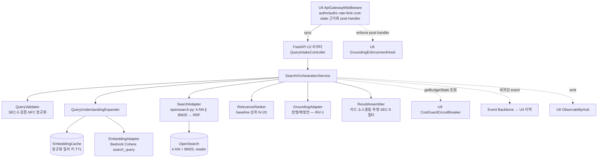

# logical-components.md — U2 Discovery 논리 컴포넌트 설계 및 토폴로지

**단계**: CONSTRUCTION → NFR Design (U2) · **유닛**: U2 Discovery · **트랙**: Track 3(@kyjness) · **일자**: 2026-06-16
**근거**: `u2-discovery-nfr-design-plan.md`(§4 답변 A) · `nfr-requirements.md`(스택) · `nfr-design-patterns.md` · `functional-design/`(7컴포넌트·INV-1)
**상태**: 확정(계획 게이트 승인)

---

## 1. 논리 컴포넌트 토폴로지 (Q7=A)

U2는 backend 모듈형 모놀리스(배포 ①)의 **동기 검색 읽기 모듈**이다. app-shell(@ELSAPHABA)이 U2 라우터를 마운트하고, U6 게이트웨이가 단일 진입·응답 엣지 근거화를 담당한다.

> **페이즈 2 개정(2026-06-29, 재인셉션)**: ResultAssembler 카드 투영이 **소스 중립**(Q2: arXiv=arxivUrl·비-arXiv=sourceUrl/DOI)으로 확장, `blockRefs`/`sourceProvenance`는 SEC-9 비노출 유지(Q3). 단일권위 근거화(INV-1)·토폴로지 불변. specVersion/alias 컷오버 폴백은 `nfr-design-patterns.md` §1.1.

### 1.1 논리 컴포넌트 목록
1. **FastAPI U2 라우터**(QueryIntakeController) — `POST /api/search` 동기 진입(app-shell 마운트, ⏳ FastAPI 합의 전제). 종단 상태→DTO 직렬화·전역 예외 핸들러(SEC-15).
2. **SearchOrchestrationService** — 동기 순차 파이프라인 + 비차단 SearchExecuted 발행.
3. **EmbeddingAdapter**(LlmGatewayAdapter 구현) — Bedrock Cohere Multilingual **v4**, `input_type=search_query`. **mock/real DI.** _(2026-06-29 정정: v3→v4 — NFR-S2, 실제 `vector-spec.yaml`.)_
4. **EmbeddingCache** — read-through(정규화 질의 키·TTL). 공유 캐시 권장(수평 확장; 소규모면 인메모리). 스토어=Infra.
5. **SearchAdapter**(VectorStoreAdapter + LexicalIndexAdapter) — opensearch-py로 k-NN∥BM25 병렬 → 앱 RRF 병합 → PaperId 디덥. **mock/real DI.**
6. **RelevanceRanker** — baseline 점수순 상위 N=20(LLM 리랭킹 없음).
7. **GroundingAdapter** — toGroundingInput/mapDecision만(**INV-1**: enforce는 U6 게이트웨이).
8. **ResultAssembler** — 폰 카드(소스 중립 투영: §5.1 + `sourceName`/`sourceUrl`, Q2)·SEC-9 비노출(`blockRefs`·`sourceProvenance` 포함)·종단 상태(PBT-09).
9. **포트(U6 소비)** — CostGuardCircuitBreaker.getBudgetState(조회·분기), GroundingEnforcementHook(U6 호출), ObservabilityHub.emit*. **개발 스텁(MR-3)** ↔ 실 U6 교체.

---

## 2. 기능 설계(FD) 매핑

**FD 7컴포넌트 + 1서비스**(business-logic-model §3)가 논리 컴포넌트에 매핑된다. 논리 컴포넌트는 backend 모놀리스 내 **단일 모듈(discovery)** 안에 공존하는 도메인 단위 + 주입 어댑터/캐시다(재계수 아님).

| FD 컴포넌트/서비스 | NFR Design 논리 컴포넌트 | 상태/주입 |
|---|---|---|
| QueryIntakeController | FastAPI U2 라우터 | stateless |
| SearchOrchestrationService | SearchOrchestrationService | stateless |
| QueryValidator | (서비스 내 순수 함수) | stateless |
| QueryUnderstandingExpander | EmbeddingAdapter + EmbeddingCache | 캐시=공유 상태 |
| HybridRetriever | SearchAdapter(opensearch-py, k-NN∥BM25, RRF) | stateless(스토어=OpenSearch) |
| RelevanceRanker | (서비스 내 순수 함수, baseline) | stateless |
| GroundingAdapter | GroundingAdapter(+ U6 포트) | INV-1 |
| ResultAssembler | (서비스 내 매핑) | stateless |

---

## 3. 상태·공유 요소 (NFR-S1 수평 확장)

| 요소 | 위치 | 비고 |
|---|---|---|
| **EmbeddingCache** | 공유 외부 캐시(권장) / 인메모리(소규모 폴백) | 정규화 질의 키·TTL. 히트율·비용. 스토어=Infra. |
| **서킷 상태**(Bedrock·OpenSearch) | 공유(권장) / 로컬 | 인스턴스 간 일관성(Q5=A). |
| **세션/인증** | **U2 미보유** | 게이트웨이(U6) 주입 — stateless 유지. |
| **degradeMode** | U6 단일 권위(조회) | U2 미저장. |

---

## 4. 데이터플레인 경계

- **동기 읽기**(NFR-P1): 게이트웨이 → U2 라우터 → 오케스트레이터 → (검증·확장·검색·랭킹·근거화 정형) → 게이트웨이 post-handler enforce → 조립 → 응답.
- **비차단 이벤트**(Q11 FD): 성공 후 `SearchExecutedEvent` → 이벤트 백본 → U4(NFR-P1 경로 밖).
- **관측성**: 단계 메트릭·로그·트레이스 → U6.ObservabilityHub(emit).
- **단일 reader 경계**: SearchAdapter만 공유 OpenSearch 인덱스를 읽는다(U1=단일 writer).

---

## 5. mock-first 토폴로지 (MR-1~4)

- **EmbeddingAdapter·SearchAdapter·포트**는 인터페이스 뒤 **2구현(mock 픽스처 / real)** — DI/환경 토글.
- **mock**: 결정적 픽스처(QT-2 평가셋 + 한국어↔영어 cross-lingual), 가짜 ANN/BM25/임베딩. U5 병렬 개발 가능.
- **real**: opensearch-py·Bedrock(U1 코퍼스·OpenSearch·Bedrock 준비 후 교체). **계약(SearchResponse)·로직 불변(MR-4).**
- **U6 포트 스텁**: Grounding=pass-through(+abstain 케이스), getBudgetState=정상 티어. 실 강제는 U6.

---

> **추적성**: 패턴↔요구사항은 `nfr-design-patterns.md` §6. 단일 권위(근거화·비용·인증·레이트리밋=U6)·INV-1/2/3 불변. 배포 타깃·캐시 스토어·수치·리전은 Infra Design.
