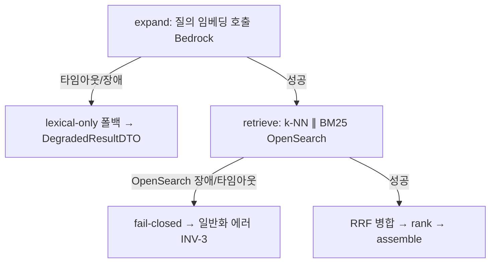

# nfr-design-patterns.md — U2 Discovery 비기능 설계 패턴

**단계**: CONSTRUCTION → NFR Design (U2) · **유닛**: U2 Discovery · **트랙**: Track 3(@kyjness) · **일자**: 2026-06-16
**근거**: `u2-discovery-nfr-design-plan.md`(§4 답변 전부 A; Q8 backend 공유 전제) · `nfr-requirements.md` · `functional-design/business-rules.md`
**상태**: 확정(계획 게이트 승인)
**고도**: 패턴·정책. 수치(타임아웃 ms·재시도·TTL·동시성)·캐시 스토어·배포 타깃·리전은 Infra Design.

---

## 1. 복원력 패턴 (Resilience)

### 1.1 동기 경로 fail-fast + 폴백 (Q1=A · NFR-P1 / RES-9 / NFR-R2)
동기 사용자 경로(P50<3s)는 **재시도로 레이턴시 예산을 잠식하지 않는다** — 실패 시 **즉시 폴백/페일클로즈**한다(U1 워커의 재시도-5회 자세와 정반대; 워커=처리량, U2=레이턴시).

- **임베딩(Bedrock) 실패/타임아웃 → 즉시 lexical-only 폴백**(저하 명시, US-R2): lexical 인덱스가 존재하므로 폴백 경로 있음.
- **OpenSearch(인덱스) 실패/타임아웃 → fail-closed**: 검색 자체 불가 → 일반화 비기술 에러(INV-3, SEC-15, NFR-R1 조용한 오답 금지). 폴백 경로 없음.
- **재시도**: 동기 경로는 0~최소(idempotent read라도 레이턴시 우선). 구체 타임아웃/재시도 수치는 Infra(DS-1).

### 1.2 의존성별 서킷 브레이커 (Q2=A · RES-9)
의존성마다 독립 서킷 — 한 의존성 장애가 전체로 전파되지 않게 한다.

| 의존 대상 | 서킷 OPEN 시 거동 | 트레이스 |
|---|---|---|
| **Bedrock 임베딩** | **lexical-only 폴백**(DegradedResultDTO·mode 표면화) | RES-9, NFR-R2, US-R2 |
| **OpenSearch 인덱스** | **fail-closed**(검색 불가·일반화 에러) | RES-9, NFR-R1, SEC-15 |

> **⚠️ 비용 degradeMode(U6) ≠ dependency 서킷(U2) 구분**: `getBudgetState().degradeMode`(NFR-C1 **비용** 신호, U6 단일 권위 조회)와 **의존성 장애 서킷**(U2 내부, **장애** 격리)은 별개 메커니즘이다. 둘 다 결과적으로 lexical-only로 수렴할 수 있으나 트리거(비용 vs 장애)와 소유(U6 vs U2)가 다르다.

---

## 2. 성능 패턴 (Performance · NFR-P1)

### 2.1 레이턴시 예산 분해 (Q4 NFR Req)
- **U2 자체 단계 예산**: 질의 임베딩(캐시 미스 시 Bedrock) + OpenSearch 하이브리드 + RRF/랭킹 + 조립.
- **U6 근거화(enforce, post-handler)는 별도 예산**(책임 분리). 종단 합이 NFR-P1(P50<3s) 충족.
- 워밍 long-running 서비스 가정(콜드스타트 제외; Lambda면 Infra 재검토).

### 2.2 임베딩 read-through 캐시 (Q3=A · NFR-P1 / NFR-C1)
- **키 = 정규화 질의(NFC, BR-2 결정성)** → **값 = 질의 임베딩 벡터**. **명시 TTL**(만료 없는 키 금지). 미스 시 Bedrock 호출 후 적재(read-through).
- **효과**: 캐시 히트 시 임베딩 레이턴시 0(NFR-P1) + 중복 임베딩 비용 0(NFR-C1).
- 스토어(공유 캐시 vs 인메모리)·TTL 수치는 Infra(DS-1).

### 2.3 하이브리드 병렬 검색 (Q4=A · NFR-P1)
- **k-NN(ANN) 쿼리 ∥ BM25 쿼리 병렬 발행**(async I/O 또는 OpenSearch `_msearch`) → 앱 레벨 **RRF 병합**(BR-4) → **PaperId 단위 디덥**(PBT-07).
- 두 검색 대기 중첩으로 레이턴시 단축.

---

## 3. 확장성 패턴 (Scalability · NFR-S1)

### 3.1 stateless 수평 확장 (Q5=A · Q6 NFR Req)
- U2는 **stateless read 모듈**(세션/상태 미보유; 인증 컨텍스트는 게이트웨이 주입) → backend 인스턴스 복제로 수평 확장.
- **공유 캐시/서킷 상태(Q5=A)**: 임베딩 캐시·서킷 상태를 **인스턴스 간 공유**해 히트율·서킷 일관성 확보(권장). **단 NFR-S1(~50 동시) 소규모면 인스턴스 로컬(인메모리)도 허용** — 비용/복잡도 trade-off는 Infra 최종 결정.
- 오토스케일 트리거·인스턴스 수·쿼터(RES-8)는 Infra.

---

## 4. 보안 패턴 (Security · 방어심층)

### 4.1 SEC-5/9/15 계층 분리 (Q6=A · defense-in-depth)
| 계층 | 패턴 | 트레이스 |
|---|---|---|
| 진입 `QueryValidator` | 도메인 입력 검증·새니타이즈(≤500자·제어문자·NFC) — U6 게이트웨이 InputValidationGuard와 **이중** | SEC-5, BR-1/2 |
| 출력 `ResultAssembler` | 내부 필드 비노출 필터(카드 7필드만; raw/RRF 점수·vector·chunkId 제거) | SEC-9, BR-6/15, INV-2 |
| 전역 `FastAPI exception_handler` | 미처리 예외 → 일반화 비기술 에러(스택/내부 비노출), fail-closed | SEC-15, BR-16, INV-3 |
| 로깅 | requestId 상관 구조화 로그, **PII/시크릿·질의 원문 정책 준수** | SEC-3, BR-17 |

> **위임(단일 권위)**: 인증·객체 인가(SEC-8)=U6 게이트웨이+U3.AuthorizationGuard; 레이트리밋(SEC-11)=U6 게이트웨이. U2는 재구현하지 않음(방어심층의 도메인 계층만).

### 4.2 공급망 (SEC-10) [backend-shared]
- 락파일(uv) + SCA + SBOM + 이미지 다이제스트 핀(`:latest` 금지). **CI 실행=GitHub Actions**(§5). backend 공유 툴링(app-shell 합의).

---

## 5. 배포 · 복원력 테스트 (보류 확정)

### 5.1 CI/CD·롤백 (Q8=A · RES-4) [backend-shared]
- **CI = GitHub Actions**: 빌드·린트·테스트·SCA·SBOM(RES-3 git-flow `feature→develop→main` 계승). U2 확정.
- **CD/배포 방식·무중단·롤백**: **Infra Design**(backend 공유 — 사용자 대면 API라 무중단(blue-green/rolling) 지향 계층 분리). 롤백=이전 이미지 다이제스트/IaC 리비전. **⚠️ app-shell(@ELSAPHABA)/Infra 합의 전제(잠정).**

### 5.2 복원력 테스트 (Q9=A · RES-12)
폴트 인젝션 스위트(QT-3 신뢰성/저하 연동):
- Bedrock 임베딩 타임아웃/장애 주입 → **lexical 폴백** 검증(§1.1/1.2).
- OpenSearch 장애 주입 → **fail-closed** 검증(NFR-R1).
- `getBudgetState` 스텁 degradeMode 토글 → **저하 배너(DegradedResultDTO·mode)** 검증.
- 빈/무매치 → **명시적 빈 페이지(SearchResultPageDTO·resultCount=0)** 경로(BR-9); 근거화 거부(verdict=abstain/block) → AbstainDTO; 검증 실패 → ValidationError.
- 실행은 Build & Test/Operations.

---

## 6. 추적성 매트릭스 (패턴 → 요구사항/규칙/검증)

| 설계 패턴 | NFR/요구사항 ID | BR | 검증 |
|---|---|---|---|
| fail-fast + 폴백 | NFR-P1, RES-9, NFR-R2 | BR-11/16 | fault-injection, QT-3 |
| 의존성별 서킷 | RES-9, NFR-R1 | BR-16 | fault-injection |
| 임베딩 read-through 캐시 | NFR-P1, NFR-C1 | BR-2(키 결정성) | unit-test |
| k-NN∥BM25 병렬 + RRF | NFR-P1, FR-2 | BR-4 | unit-test, PBT-07 |
| stateless 수평 확장 + 공유 상태 | NFR-S1, RES-8 | — | integration-test(Infra) |
| SEC 계층 분리(방어심층) | SEC-5/9/15/3 | BR-1/2/6/15/16/17 | unit-test, security-scan |
| 공급망(SCA/SBOM/핀) | SEC-10 | — | CI(GHA) |
| CI=GHA / 무중단 CD(Infra) | RES-3/4 | — | CI pipeline |
| 폴트 인젝션 스위트 | RES-12 | BR-9/10/11/16 | RES-12 test |
| PBT(정규화·랭킹·디덥·DTO) | QT-4 | BR-2/4/5/9/15 | PBT-02/03/07/09 |

> 논리 컴포넌트·토폴로지는 `logical-components.md`. 단일 권위(근거화·비용·인증·레이트리밋=U6)·INV-1/2/3 불변.
