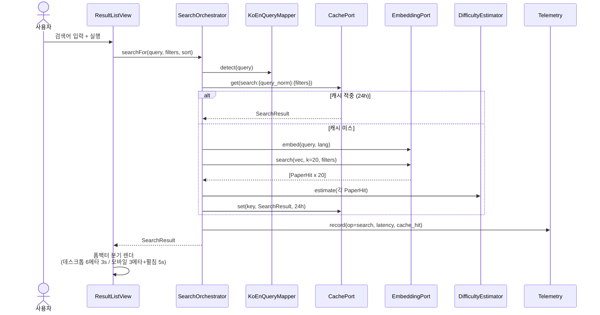
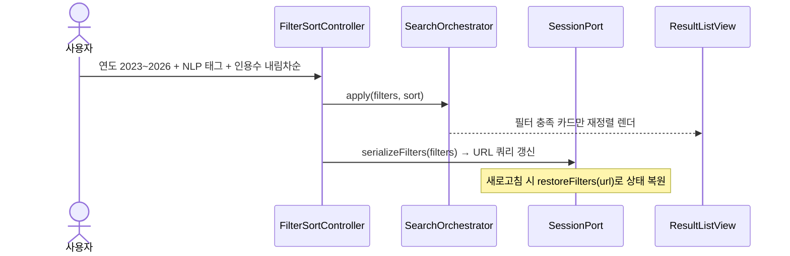
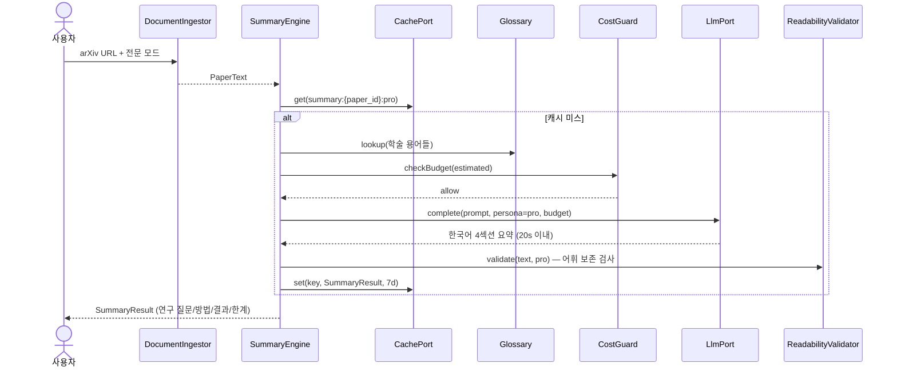
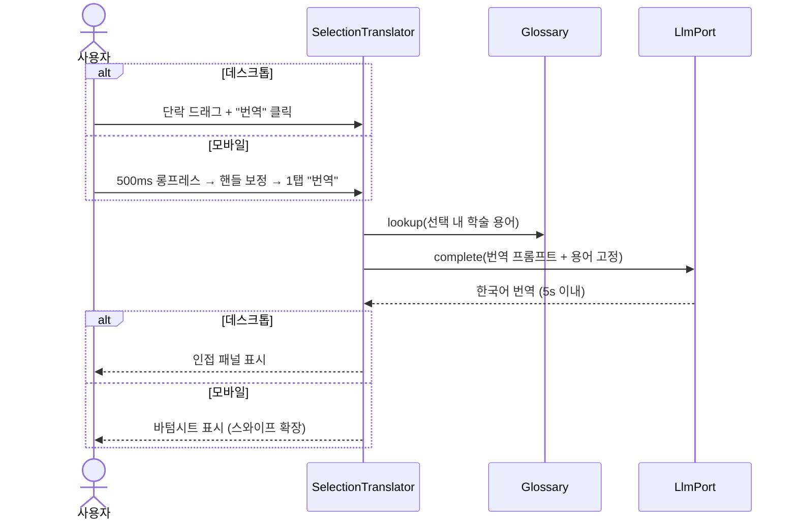
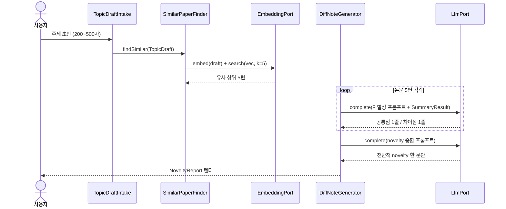

# DocSuri MVP — 컴포넌트 모델

> **Phase**: AIDLC Construction — Domain(Component) Model
> **근거 산출물**: [`design-artifacts/units/`](units/) (U0~U4, 14 스토리 / 70 SP) — *AI-DLC 산출물만 입력으로 사용. `aidlc-docs/` 밖의 코드·문서는 근거로 삼지 않는다.*
> **작업 계획**: [`component_model_plan.md`](../plans/component_model_plan.md)
> **원칙**: 본 모델은 *기술 중립*이다. 포트/인터페이스 수준에서 기술하며, 구현체 선택([D1](../story-artifacts/handoff.md#d-1)~[D10](../story-artifacts/handoff.md#d-10))은 후속 단계에서 닫는다. 코드는 생성하지 않는다.

---

## 0. 모델링 규약

모든 컴포넌트는 아래 양식으로 기술한다.

| 항목 | 의미 |
|---|---|
| **소속** | 컴포넌트를 소유한 unit (변경 정책의 주체) |
| **책임** | 1줄 미션 — 이 컴포넌트가 *유일하게* 결정하는 것 |
| **속성** | 컴포넌트가 보유·관리하는 상태/데이터 |
| **행위** | 외부에 노출하는 연산 (개념 시그니처, 영문 유지) |
| **의존** | 호출하는 다른 컴포넌트/포트 (방향: 본 컴포넌트 → 대상) |
| **NFR** | 본 컴포넌트가 충족 책임을 지는 비기능 요구 |
| **출처** | 근거 user story / [handoff](../story-artifacts/handoff.md) 항목 |

표기 규칙:
- `Port` 접미사 = U0가 제공하는 안정 인터페이스 (구현체 교체 가능).
- `*Result`·`*View`·`*Report` = unit 간 합의된 DTO (각 unit의 "유일한 약속").
- UI 컴포넌트는 `*View`·`*Controller` 접미사로 도메인 컴포넌트와 구분.

식별자 원본 (본문 모든 키·ID는 아래 원본 정의로 하이퍼링크된다):

| 식별자 | 의미 | 원본 문서 |
|---|---|---|
| `US-{DISC\|COMP\|DIFF\|TRACE}-NN` | User Story | [`story-artifacts/user_stories.md`](../story-artifacts/user_stories.md) |
| `NFR-{영역}-NN` | 비기능 요구사항 | [`requirements/nfr.md`](../requirements/nfr.md) |
| `D1`~`D10` | Open Decision (미결 기술 결정) | [`story-artifacts/handoff.md §4`](../story-artifacts/handoff.md) |
| `A1`~`A8` | Assumption (가정) | [`story-artifacts/handoff.md §3`](../story-artifacts/handoff.md) |
| `R1`~`R7` | Risk (위험) | [`story-artifacts/handoff.md §2`](../story-artifacts/handoff.md) |
| `U0`~`U4` | Unit (빌드 독립 단위) | [`design-artifacts/units/`](units/) |

---

## 1. 전체 컴포넌트 관계도

```mermaid
flowchart TB
    subgraph U1["U1 Discover"]
        SO[SearchOrchestrator]
        KE[KeywordExpander]
        DE[DifficultyEstimator]
        KQ[KoEnQueryMapper]
        FS[FilterSortController]
        RV[ResultListView]
    end

    subgraph U2["U2 Comprehend"]
        DI[DocumentIngestor]
        SE[SummaryEngine]
        RVD[ReadabilityValidator]
        ST[SectionToggleController]
        TR[SelectionTranslator]
        FE[FigureExplainer]
    end

    subgraph U3["U3 Differentiate"]
        TI[TopicDraftIntake]
        SF[SimilarPaperFinder]
        DN[DiffNoteGenerator]
        GP[GapProposer]
        LC[LightCheckAdvisor]
    end

    subgraph U4["U4 Trace"]
        CF[CitationFetcher]
        FR[FormFactorRouter]
        GV[CitationGraphView]
        LV[CitationListView]
        T3[TopInfluenceSelector]
    end

    subgraph U0["U0 Foundation"]
        EP[EmbeddingPort]
        LP[LlmPort]
        CG[CostGuard]
        CP[CachePort]
        SP[SessionPort]
        TM[Telemetry]
        GL[Glossary]
        CA[CitationApi]
        HP[HttpClientPolicy]
    end

    SO --> EP
    SO --> CP
    KE --> LP
    KQ --> LP
    FS --> SP

    SE --> LP
    SE --> GL
    SE --> CP
    TR --> LP
    TR --> GL
    FE --> LP

    SF --> EP
    DN --> LP
    GP --> LP
    LC --> LP

    CF --> CA
    CF --> CP

    U1 -- "SearchResult" --> U3
    U2 -- "SummaryResult" --> U3
    U1 -- "SearchResult.papers[i].id" --> U4
```



**Acyclic 검증 ✅** — 도메인 unit 간 의존은 *U1→U3, U2→U3, U1→U4* 세 방향뿐이며, 모든 unit이 U0를 단방향 의존한다. 순환 0건 ([units-overview §2](units/units-overview.md)와 정합).

> Telemetry는 가독성을 위해 화살표를 생략했다 — **모든 외부 호출 컴포넌트**(SO·KE·KQ·SE·TR·FE·SF·DN·GP·LC·CF)가 `Telemetry.record`를 호출한다 (§9 횡단 매핑 참조).

---

## 2. U0 Foundation 컴포넌트

> U0의 유일한 약속은 **포트 시그니처**다. 도메인 로직(요약 톤·노트 형식 등)을 U0에 두는 것은 금지 ([U0 §8](units/unit-u0-foundation.md)).

### 2.1 EmbeddingPort

| 항목 | 내용 |
|---|---|
| 소속 | U0 |
| 책임 | 텍스트 → 벡터 변환과 코퍼스 인덱스 검색의 단일 진입 |
| 속성 | `model_id` ([D3](../story-artifacts/handoff.md#d-3)에서 확정), `index_ref` → CorpusIndex |
| 행위 | `embed(text: str, lang: 'ko'\|'en') -> Vector` · `search(vec: Vector, k: int, filters?) -> [PaperHit]` |
| 의존 | CorpusIndex(정적 자산), Embedding Provider API, HttpClientPolicy, Telemetry |
| NFR | [NFR-PERF-01](../requirements/nfr.md#nfr-perf-01) (raw 응답 시간 측정·기록), [NFR-MOBILE-03](../requirements/nfr.md#nfr-mobile-03) |
| 출처 | [U0 §3](units/unit-u0-foundation.md) · [D2](../story-artifacts/handoff.md#d-2)·[D3](../story-artifacts/handoff.md#d-3) |

`PaperHit` 스키마(개념): `{ id, title, authors, year, citations, similarity, field_tags, abstract_len }` — U1의 난이도 추정과 카드 렌더에 필요한 메타를 포함한다.

### 2.2 LlmPort + CostGuard

| 항목 | LlmPort | CostGuard |
|---|---|---|
| 소속 | U0 | U0 (LlmPort 게이트웨이 내장) |
| 책임 | 페르소나·토큰 예산 명시 LLM 호출의 단일 진입 | LLM 비용 상한 강제 ([R3](../story-artifacts/handoff.md#r-3) 흡수) |
| 속성 | `model_id` ([D4](../story-artifacts/handoff.md#d-4)에서 확정) | `monthly_cap_usd`, `accumulated_cost`, `per_call_budget_tokens` |
| 행위 | `complete(prompt: str, persona: 'pro'\|'undergrad', budget_tokens: int) -> Completion` | `checkBudget(estimated_tokens) -> allow\|reject` · `recordCost(tokens_in, tokens_out)` |
| 의존 | CostGuard(모든 호출 전후), LLM Provider API, HttpClientPolicy, Telemetry | Telemetry (비용 누적치 산정 공유) |
| NFR | [NFR-PERF-02](../requirements/nfr.md#nfr-perf-02) | [NFR-COST-01·02](../requirements/nfr.md#nfr-cost-01) |
| 출처 | [U0 §3](units/unit-u0-foundation.md) · [D4](../story-artifacts/handoff.md#d-4) | [U0 §4](units/unit-u0-foundation.md)·§7 ([R3](../story-artifacts/handoff.md#r-3)) |

> CostGuard는 *인프라 정책*이므로 U0 소속이 정당하다 ([U0 §4](units/unit-u0-foundation.md): "상한 가드는 U0의 게이트웨이가 강제"). 무엇을 요약할지·어떤 톤일지는 호출 unit이 결정한다.

### 2.3 CachePort

| 항목 | 내용 |
|---|---|
| 소속 | U0 |
| 책임 | TTL 캐시의 단일 정책 제공 — *키 설계는 호출 unit 책임* |
| 속성 | TTL 프리셋: `24h`(검색·인용), `7d`(요약) — [NFR-DATA-03](../requirements/nfr.md#nfr-data-03) |
| 행위 | `get(key) -> bytes\|None` · `set(key, value, ttl_s)` |
| 의존 | 클라이언트측 저장 메커니즘 ([D8](../story-artifacts/handoff.md#d-8)에서 확정) |
| NFR | [NFR-DATA-03](../requirements/nfr.md#nfr-data-03), [NFR-NET-04](../requirements/nfr.md#nfr-net-04) (오프라인 24h 읽기, [R6](../story-artifacts/handoff.md#r-6) 흡수) |
| 출처 | [U0 §3](units/unit-u0-foundation.md) · [D8](../story-artifacts/handoff.md#d-8) |

### 2.4 SessionPort

| 항목 | 내용 |
|---|---|
| 소속 | U0 |
| 책임 | 비로그인 익명 세션과 필터 URL 직렬화의 단일 진입 |
| 속성 | `anon_id`, `persona_mode: 'pro'\|'undergrad'`, `filters_url` |
| 행위 | `session() -> { anon_id, persona_mode, filters_url }` · `serializeFilters(filters) -> url_query` · `restoreFilters(url_query) -> filters` |
| 의존 | (없음 — 자급) |
| NFR | [NFR-SEC-01](../requirements/nfr.md#nfr-sec-01) (비로그인), [NFR-SEC-03](../requirements/nfr.md#nfr-sec-03) (환경 변수 키 관리는 U0 로딩 모듈 동거) |
| 출처 | [U0 §3](units/unit-u0-foundation.md) |

### 2.5 Telemetry

| 항목 | 내용 |
|---|---|
| 소속 | U0 |
| 책임 | 모든 외부 호출의 관찰가능성 단일 파이프라인 + LLM 비용 누적 산정 |
| 속성 | 백엔드 ([D10](../story-artifacts/handoff.md#d-10)에서 확정) |
| 행위 | `record({op, latency_ms, tokens_in, tokens_out, cache_hit, persona})` |
| 의존 | (없음) |
| NFR | [NFR-OBS-01·02](../requirements/nfr.md#nfr-obs-01), [NFR-COST-01](../requirements/nfr.md#nfr-cost-01) (누적치 산정) |
| 출처 | [U0 §3](units/unit-u0-foundation.md)·§4 |

### 2.6 Glossary

| 항목 | 내용 |
|---|---|
| 소속 | U0 |
| 책임 | 학술 용어 정규 한국어 번역의 단일 사전 |
| 속성 | `seed_entries` (50개, [A6](../story-artifacts/handoff.md#a-6)) — *사후 확장 가능* 구조 ([R5](../story-artifacts/handoff.md#r-5)) |
| 행위 | `lookup(term: str) -> KoTranslation?` |
| 의존 | GlossarySeed(정적 자산) |
| NFR | [NFR-LANG-03](../requirements/nfr.md#nfr-lang-03) (일관 번역) |
| 출처 | [U0 §3](units/unit-u0-foundation.md)·§7 ([R5](../story-artifacts/handoff.md#r-5)) |

### 2.7 CitationApi

| 항목 | 내용 |
|---|---|
| 소속 | U0 |
| 책임 | Semantic Scholar 1-hop 조회의 래퍼 — *캐시 + 폴백 내장* ([R4](../story-artifacts/handoff.md#r-4) 흡수) |
| 속성 | `api_version`, 폴백 정책 (캐시 스테일 허용 → 빈 상태 안내) |
| 행위 | `oneHop(paper_id) -> { outgoing: [PaperHit], incoming: [PaperHit] }` |
| 의존 | Semantic Scholar API, CachePort, HttpClientPolicy, Telemetry |
| NFR | [NFR-DATA-01·02](../requirements/nfr.md#nfr-data-01) (출처 표시용 메타 포함) |
| 출처 | [U0 §3](units/unit-u0-foundation.md)·§7 ([R4](../story-artifacts/handoff.md#r-4)) |

### 2.8 HttpClientPolicy

| 항목 | 내용 |
|---|---|
| 소속 | U0 |
| 책임 | 데이터 절약·재시도·오프라인 빈 상태의 표준 HTTP 정책 |
| 속성 | 재시도 횟수·백오프, 데이터 절약 모드 플래그 |
| 행위 | (내부 정책 — 포트 구현체들이 공유) |
| 의존 | (없음) |
| NFR | [NFR-NET-01·02·03](../requirements/nfr.md#nfr-net-01) |
| 출처 | [U0 §4](units/unit-u0-foundation.md) |

### 2.9 정적 자산 (운영자 입력)

| 자산 | 내용 | 출처 |
|---|---|---|
| `CorpusIndex` | arXiv 메타데이터 + 임베딩 인덱스, 1회 빌드 | [A1](../story-artifacts/handoff.md#a-1) · [D2](../story-artifacts/handoff.md#d-2) |
| `GlossarySeed` | 학술 용어 50개 정규 번역 | [A6](../story-artifacts/handoff.md#a-6) |

---

## 3. U1 Discover 컴포넌트

### 3.1 SearchOrchestrator

| 항목 | 내용 |
|---|---|
| 소속 | U1 |
| 책임 | 검색 요청 1건의 전체 흐름 조율 — 캐시 → 임베딩 → 검색 → 난이도 부착 → `SearchResult` 조립 |
| 속성 | `k = 20` (상위 결과 수) |
| 행위 | `searchFor(query: str, filters, sort_key) -> SearchResult` |
| 의존 | CachePort(24h, 키: `search:{query_norm}:{filters}`), KoEnQueryMapper, EmbeddingPort.embed/search, DifficultyEstimator, Telemetry |
| NFR | [NFR-PERF-01](../requirements/nfr.md#nfr-perf-01) (체감 P50<3s 데스크톱), [NFR-MOBILE-03](../requirements/nfr.md#nfr-mobile-03) (4G P95<5s) |
| 출처 | [US-DISC-01](../story-artifacts/user_stories.md#us-disc-01) |

### 3.2 KoEnQueryMapper

| 항목 | 내용 |
|---|---|
| 소속 | U1 |
| 책임 | 입력 언어 감지 + 한국어 질문의 영문 키워드 매핑과 그 *1줄 설명* 생성 |
| 속성 | (무상태) |
| 행위 | `detect(query) -> 'ko'\|'en'` · `mapExplain(ko_query) -> { en_keywords, explanation_1line }` |
| 의존 | LlmPort (매핑 설명), Telemetry |
| NFR | [NFR-LANG-01·02](../requirements/nfr.md#nfr-lang-01) |
| 출처 | [US-DISC-04](../story-artifacts/user_stories.md#us-disc-04) |

### 3.3 KeywordExpander

| 항목 | 내용 |
|---|---|
| 소속 | U1 |
| 책임 | 동의어·관련 용어 확장 목록 생성과 체크/해제 즉시 재검색 |
| 속성 | `expanded_terms: [{ term, checked: bool }]` |
| 행위 | `expand(query) -> [ExpandedTerm]` · `toggle(term) -> 재검색 트리거` |
| 의존 | LlmPort, SearchOrchestrator(재검색), Telemetry |
| NFR | [NFR-PERF-01](../requirements/nfr.md#nfr-perf-01) |
| 출처 | [US-DISC-03](../story-artifacts/user_stories.md#us-disc-03) |

### 3.4 DifficultyEstimator

| 항목 | 내용 |
|---|---|
| 소속 | U1 |
| 책임 | 논문 1편의 난이도 점수·라벨(입문/중급/고급) 추정 — [A7](../story-artifacts/handoff.md#a-7) 휴리스틱의 단일 구현 |
| 속성 | 휴리스틱 가중치: 분야 태그 + 인용수 + 길이 + 어휘 빈도 |
| 행위 | `estimate(paper_hit: PaperHit) -> { score: float, label: '입문'\|'중급'\|'고급' }` |
| 의존 | (없음 — PaperHit 메타만 사용, LLM 미호출) |
| NFR | [NFR-UX-01](../requirements/nfr.md#nfr-ux-01) (입문 적합 상위 노출의 근거), 정밀도 평가는 U1 책임 ([U1 §7](units/unit-u1-discover.md)) |
| 출처 | [US-DISC-01](../story-artifacts/user_stories.md#us-disc-01)·04 · [A7](../story-artifacts/handoff.md#a-7) |

### 3.5 FilterSortController

| 항목 | 내용 |
|---|---|
| 소속 | U1 |
| 책임 | 정렬·필터 상태의 단일 보유 + URL 직렬화 왕복 |
| 속성 | `year_range`, `field_tags: [str]`, `sort_key: 'similarity'\|'citations'\|'recency'` |
| 행위 | `apply(filters, sort) -> 목록 갱신` · `toUrl() / fromUrl()` (SessionPort 위임) |
| 의존 | SessionPort.serializeFilters/restoreFilters, SearchOrchestrator |
| NFR | [NFR-UX-03](../requirements/nfr.md#nfr-ux-03), [NFR-MOBILE-04](../requirements/nfr.md#nfr-mobile-04) (모바일 1~2탭 도달) |
| 출처 | [US-DISC-02](../story-artifacts/user_stories.md#us-disc-02) |

### 3.6 ResultListView

| 항목 | 내용 |
|---|---|
| 소속 | U1 ([D5](../story-artifacts/handoff.md#d-5)·[D6](../story-artifacts/handoff.md#d-6) 결정의 시작점) |
| 책임 | `SearchResult`의 폼팩터별 카드 렌더 — 데스크톱 6 메타 1뷰 / 모바일 3 메타 + "더 보기" 펼침 |
| 속성 | 브레이크포인트 360/768/1280 ([NFR-MOBILE-01](../requirements/nfr.md#nfr-mobile-01)), 모바일 단일 액션 바 |
| 행위 | `render(result: SearchResult, viewport)` · `expandCard(id)` (모바일) |
| 의존 | FilterSortController(액션 바), DifficultyEstimator 라벨 표시 |
| NFR | [NFR-UX-03](../requirements/nfr.md#nfr-ux-03), [NFR-MOBILE-01·04](../requirements/nfr.md#nfr-mobile-01), [NFR-A11Y-01](../requirements/nfr.md#nfr-a11y-01) (ARIA·콘트라스트) |
| 출처 | [US-DISC-01](../story-artifacts/user_stories.md#us-disc-01)·02·04 · [R1](../story-artifacts/handoff.md#r-1) 일부 (모바일 와이어프레임 보강은 U1 책임) |

### 3.7 출력 DTO — `SearchResult`

```
{ query, expanded_terms, papers: [{ id, title, authors, year, citations, similarity, difficulty }], filters, lang }
```
사용 unit: U3 (유사 논문 메타), U4 (`papers[i].id` 중심 논문 선택). **mock 가능** — 시드 JSON으로 U3·U4 독립 빌드 지원 ([U1 §3](units/unit-u1-discover.md)).

---

## 4. U2 Comprehend 컴포넌트

### 4.1 DocumentIngestor

| 항목 | 내용 |
|---|---|
| 소속 | U2 |
| 책임 | PDF 파일/arXiv URL → 구조화 텍스트 추출의 단일 진입 |
| 속성 | 추출 라이브러리 ([U2 §5](units/unit-u2-comprehend.md)에서 확정 — PyMuPDF/pdfplumber/pdf.js, [D1](../story-artifacts/handoff.md#d-1)·[D5](../story-artifacts/handoff.md#d-5) 분담) |
| 행위 | `ingest(source: pdf\|url) -> PaperText { paper_id, title, sections: [...], figures: [{ id, caption, context }] }` |
| 의존 | HttpClientPolicy (URL fetch), Telemetry |
| NFR | [NFR-PERF-02](../requirements/nfr.md#nfr-perf-02) (추출 시간이 20s 예산에 포함) |
| 출처 | [US-COMP-01](../story-artifacts/user_stories.md#us-comp-01) · [U2 §3](units/unit-u2-comprehend.md) 입력 |

### 4.2 SummaryEngine

| 항목 | 내용 |
|---|---|
| 소속 | U2 |
| 책임 | 페르소나 분기 요약의 단일 결정자 — 전문/학부 *다른 톤*, 4 섹션 구조, 용어 사전 강제 |
| 속성 | 모드별 프롬프트 템플릿 (`pro`: 전문 어휘 원형 보존+한국어 병기 / `undergrad`: KKL 4급 이하·약어 풀이·수식 1줄 해석), 청크 압축 정책 ([NFR-COST-02](../requirements/nfr.md#nfr-cost-02)) |
| 행위 | `summarize(paper_text: PaperText, mode) -> SummaryResult` |
| 의존 | CachePort(7d, 키: `summary:{paper_id}:{mode}`), Glossary.lookup, LlmPort.complete(persona), ReadabilityValidator(후처리), Telemetry |
| NFR | [NFR-PERF-02](../requirements/nfr.md#nfr-perf-02) (P95<20s 데스크톱 / 25s 4G), [NFR-UX-01·02](../requirements/nfr.md#nfr-ux-01), [NFR-LANG-01·03](../requirements/nfr.md#nfr-lang-01), [NFR-COST-01·02](../requirements/nfr.md#nfr-cost-01) |
| 출처 | [US-COMP-01](../story-artifacts/user_stories.md#us-comp-01)·03 |

### 4.3 ReadabilityValidator

| 항목 | 내용 |
|---|---|
| 소속 | U2 |
| 책임 | 모드별 출력 품질의 후처리 검증 — 학부 모드 가독성 / 전문 모드 어휘 보존 |
| 속성 | 학부 기준: 평균 문장 ≤22 어절, KKL 4급 이하 어휘 비율; 전문 기준: 원형 보존 검사 |
| 행위 | `validate(text, mode) -> { pass: bool, metrics }` — 실패 시 SummaryEngine이 재생성 1회 |
| 의존 | (없음 — 로컬 측정) |
| NFR | [NFR-UX-01·02](../requirements/nfr.md#nfr-ux-01)의 *검증 도구* ([U2 §5](units/unit-u2-comprehend.md)·§6 자동 보고서 근거) |
| 출처 | [US-COMP-03](../story-artifacts/user_stories.md#us-comp-03) · [U2 §6](units/unit-u2-comprehend.md) |

### 4.4 SectionToggleController

| 항목 | 내용 |
|---|---|
| 소속 | U2 |
| 책임 | 요약 4 섹션의 접힘/펼침 상태와 *세션 내 기본값 유지* |
| 속성 | `collapsed: { question, method, result, limit }` — 동일 세션 다른 요약에 기본값 전파 |
| 행위 | `toggle(section)` · `defaultsFor(new_summary) -> collapsed` |
| 의존 | SessionPort (세션 스코프 저장) |
| NFR | [NFR-UX-03](../requirements/nfr.md#nfr-ux-03), [NFR-A11Y-02](../requirements/nfr.md#nfr-a11y-02) (키보드 토글) |
| 출처 | [US-COMP-02](../story-artifacts/user_stories.md#us-comp-02) |

### 4.5 SelectionTranslator

| 항목 | 내용 |
|---|---|
| 소속 | U2 |
| 책임 | 본문 단락 선택(데스크톱 드래그 / 모바일 500ms 롱프레스+핸들 보정) → 한국어 번역의 전체 흐름 |
| 속성 | 입력 모드 분기, 출력 분기: 데스크톱 인접 패널 / 모바일 바텀시트(스와이프 확장, [A8](../story-artifacts/handoff.md#a-8)) |
| 행위 | `select(range, input_mode)` · `translate(selection) -> TranslationResult` |
| 의존 | Glossary.lookup (일관 번역 강제), LlmPort.complete, Telemetry |
| NFR | [NFR-PERF-02](../requirements/nfr.md#nfr-perf-02) (5s), [NFR-LANG-01·03](../requirements/nfr.md#nfr-lang-01), [NFR-MOBILE-02·04](../requirements/nfr.md#nfr-mobile-02) (터치 타깃 ≥44px·1탭), [NFR-A11Y-03](../requirements/nfr.md#nfr-a11y-03) |
| 출처 | [US-COMP-04](../story-artifacts/user_stories.md#us-comp-04) |

### 4.6 FigureExplainer

| 항목 | 내용 |
|---|---|
| 소속 | U2 |
| 책임 | 그림/표 탭·클릭 → 캡션+주변 문맥 기반 1~2문장 한국어 설명 |
| 속성 | 터치 타깃 ≥44 CSS px |
| 행위 | `explain(figure: { caption, context }) -> str` |
| 의존 | LlmPort.complete, Telemetry |
| NFR | [NFR-UX-01](../requirements/nfr.md#nfr-ux-01), [NFR-LANG-01](../requirements/nfr.md#nfr-lang-01), [NFR-MOBILE-02](../requirements/nfr.md#nfr-mobile-02), [NFR-A11Y-03](../requirements/nfr.md#nfr-a11y-03) |
| 출처 | [US-COMP-05](../story-artifacts/user_stories.md#us-comp-05) |

### 4.7 출력 DTO — `SummaryResult` · `TranslationResult`

```
SummaryResult     { paper_id, mode: 'pro'|'undergrad', sections: { question, method, result, limit },
                    vocab_explanations: [...], cost: { tokens_in, tokens_out } }
TranslationResult { source_excerpt, target_text, glossary_hits }
```
`SummaryResult` 사용 unit: U3 (차별성 노트 근거). `TranslationResult`는 UI 내부 전용. **금지**: `SummaryResult`에 차별성·인용 정보 추가 ([U2 §8](units/unit-u2-comprehend.md) — U3·U4의 책임).

---

## 5. U3 Differentiate 컴포넌트

### 5.1 TopicDraftIntake

| 항목 | 내용 |
|---|---|
| 소속 | U3 |
| 책임 | 주제 초안 입력 검증·정규화 — 전문 200~500자 / 학부 한국어 3~5문장 |
| 속성 | 모드별 길이·언어 규칙 · 모바일은 *읽기 전용 결과 확인* 가정 ([R1](../story-artifacts/handoff.md#r-1) — 실증 또는 폐기 책임) |
| 행위 | `intake(draft, mode) -> TopicDraft \| ValidationError` |
| 의존 | SessionPort (persona_mode) |
| NFR | [NFR-LANG-01·02](../requirements/nfr.md#nfr-lang-01) |
| 출처 | [US-DIFF-01](../story-artifacts/user_stories.md#us-diff-01)·03 |

### 5.2 SimilarPaperFinder

| 항목 | 내용 |
|---|---|
| 소속 | U3 |
| 책임 | 주제 초안 → 임베딩 유사도 상위 5편 식별. **검색 인덱스 재구현 금지** — U0 포트만 사용 ([U3 §8](units/unit-u3-differentiate.md)) |
| 속성 | `k = 5` |
| 행위 | `findSimilar(draft: TopicDraft) -> [PaperHit]` (U1 `SearchResult.papers` 스키마 정합) |
| 의존 | EmbeddingPort.embed/search, Telemetry · (대안 입력: U1 `SearchResult` mock — 독립 빌드용) |
| NFR | [NFR-DATA-02](../requirements/nfr.md#nfr-data-02) (논문 ID → 원문 링크 추적성) |
| 출처 | [US-DIFF-01](../story-artifacts/user_stories.md#us-diff-01) |

### 5.3 DiffNoteGenerator

| 항목 | 내용 |
|---|---|
| 소속 | U3 |
| 책임 | 유사 논문별 "공통점 1줄 / 차이점 1줄" 노트 + 한 문단 "전반적 novelty 평가" 생성 |
| 속성 | 차별성 노트 프롬프트 ([U3 §5](units/unit-u3-differentiate.md) — 톤 일관성 책임), 청크 압축 강제 |
| 행위 | `noteFor(draft, paper, summary: SummaryResult) -> { common, diff }` · `overallNovelty(draft, notes) -> str` |
| 의존 | U2 `SummaryResult` (mock 가능), LlmPort.complete, Glossary, Telemetry |
| NFR | [NFR-UX-02](../requirements/nfr.md#nfr-ux-02) (전문 어휘 톤), [NFR-COST-01·02](../requirements/nfr.md#nfr-cost-01) (*비용 폭증 주범 후보* — [R3](../story-artifacts/handoff.md#r-3) 1차 가드 책임, [U3 §7](units/unit-u3-differentiate.md)) |
| 출처 | [US-DIFF-01](../story-artifacts/user_stories.md#us-diff-01) |

### 5.4 GapProposer

| 항목 | 내용 |
|---|---|
| 소속 | U3 |
| 책임 | 유사 5편의 *방법·데이터셋·평가지표* 차이에서 연구 공백 후보 3개 추출 — 각 후보에 근거 논문 ID 명시 |
| 속성 | 공백 추출 휴리스틱 ([U3 §5](units/unit-u3-differentiate.md)) |
| 행위 | `propose(draft, notes) -> [{ title, body, evidence_ids }]` (정확히 3개) |
| 의존 | DiffNoteGenerator 결과, LlmPort.complete, Telemetry |
| NFR | [NFR-DATA-02](../requirements/nfr.md#nfr-data-02) (evidence_ids → 원문 링크), [NFR-COST-01](../requirements/nfr.md#nfr-cost-01) |
| 출처 | [US-DIFF-02](../story-artifacts/user_stories.md#us-diff-02) |

### 5.5 LightCheckAdvisor

| 항목 | 내용 |
|---|---|
| 소속 | U3 |
| 책임 | 학부 모드 가벼운 점검 — "흔한 시도인지" 한 문단 평가 + 차별점 1줄 |
| 속성 | 학부 톤 프롬프트 ([NFR-UX-01](../requirements/nfr.md#nfr-ux-01) 준수) |
| 행위 | `lightCheck(draft: TopicDraft) -> { assessment_paragraph, diff_point_1line }` |
| 의존 | SimilarPaperFinder, LlmPort.complete(persona='undergrad'), Telemetry |
| NFR | [NFR-UX-01](../requirements/nfr.md#nfr-ux-01), [NFR-LANG-01](../requirements/nfr.md#nfr-lang-01) |
| 출처 | [US-DIFF-03](../story-artifacts/user_stories.md#us-diff-03) |

### 5.6 출력 DTO — `NoveltyReport`

```
{ user_topic, similar_papers: [{ paper, common, diff }], overall_novelty,
  gap_proposals: [{ title, body, evidence_ids }], persona_mode }
```
사용: UI 렌더 전용. [R2](../story-artifacts/handoff.md#r-2) ([DIFF-01](../story-artifacts/user_stories.md#us-diff-01)·02 SP 8 분해)는 본 모델에서 *임베딩 비교*(SimilarPaperFinder)와 *LLM 차별성 노트*(DiffNoteGenerator)를 별도 컴포넌트로 분리함으로써 sub-스토리 분해 경계를 선제 확보했다.

---

## 6. U4 Trace 컴포넌트

### 6.1 CitationFetcher

| 항목 | 내용 |
|---|---|
| 소속 | U4 |
| 책임 | 중심 논문 1-hop 인용 데이터 확보 — 캐시 우선, API 폴백 |
| 속성 | 캐시 키: `cite:{paper_id}:{api_version}:{time_window}` ([U4 §5](units/unit-u4-trace.md)), TTL 24h |
| 행위 | `fetch(paper_id) -> { center, outgoing: [PaperHit], incoming: [PaperHit] }` |
| 의존 | CachePort, CitationApi.oneHop, Telemetry (캐시 적중률·폴백 실증 — [R4](../story-artifacts/handoff.md#r-4)) |
| NFR | [NFR-PERF-03](../requirements/nfr.md#nfr-perf-03), [NFR-DATA-01·02](../requirements/nfr.md#nfr-data-01) (Semantic Scholar 출처 노출) |
| 출처 | [US-TRACE-01](../story-artifacts/user_stories.md#us-trace-01) |

### 6.2 FormFactorRouter

| 항목 | 내용 |
|---|---|
| 소속 | U4 |
| 책임 | 렌더 모드 분기의 단일 결정 — `<768px` 또는 학부 모드 → 리스트, 그 외 → 그래프 |
| 속성 | 분기 규칙: viewport([NFR-MOBILE-05](../requirements/nfr.md#nfr-mobile-05)) + persona_mode([TRACE-02](../story-artifacts/user_stories.md#us-trace-02)) |
| 행위 | `route(viewport, persona_mode) -> 'graph'\|'list'` |
| 의존 | SessionPort (persona_mode) |
| NFR | [NFR-MOBILE-05](../requirements/nfr.md#nfr-mobile-05) (강제 분기) |
| 출처 | [US-TRACE-01](../story-artifacts/user_stories.md#us-trace-01) 모바일 분기 · [US-TRACE-02](../story-artifacts/user_stories.md#us-trace-02) |

### 6.3 CitationGraphView

| 항목 | 내용 |
|---|---|
| 소속 | U4 ([D7](../story-artifacts/handoff.md#d-7) — 데스크톱 전용 라이브러리 도입 가능) |
| 책임 | 중심+인용+피인용 노드 그래프 렌더 (≤30 노드) + 노드 선택 → 사이드 패널 논문 카드 |
| 속성 | `max_nodes = 30`, 레이아웃 알고리즘 (단독 변경 가능) |
| 행위 | `render(view: CitationView)` · `onNodeSelect(id) -> 사이드 패널 열기` |
| 의존 | U1 ResultListView의 논문 카드 컴포넌트 *재사용* (사이드 패널 내용) |
| NFR | [NFR-PERF-03](../requirements/nfr.md#nfr-perf-03) (P95<5s 렌더 완료), [NFR-A11Y-02](../requirements/nfr.md#nfr-a11y-02) (노드 키보드 내비·포커스 링), [NFR-A11Y-03](../requirements/nfr.md#nfr-a11y-03) |
| 출처 | [US-TRACE-01](../story-artifacts/user_stories.md#us-trace-01) 데스크톱 |

### 6.4 CitationListView

| 항목 | 내용 |
|---|---|
| 소속 | U4 |
| 책임 | 모바일·학부용 간소화 리스트 — "중심/인용/피인용" 3 섹션 + 제목·저자 즉시 필터 |
| 속성 | 상단 노드 검색창, 항목당 "논문 카드 열기" 버튼 (1탭, ≥44px) |
| 행위 | `render(view: CitationView)` · `filter(text)` · `openCard(id) -> 바텀시트` |
| 의존 | U1 논문 카드 컴포넌트 재사용 |
| NFR | [NFR-MOBILE-03](../requirements/nfr.md#nfr-mobile-03) (4G P95<7s), [NFR-A11Y-03](../requirements/nfr.md#nfr-a11y-03) |
| 출처 | [US-TRACE-01](../story-artifacts/user_stories.md#us-trace-01) 모바일 분기 |

### 6.5 TopInfluenceSelector

| 항목 | 내용 |
|---|---|
| 소속 | U4 |
| 책임 | 피인용(incoming) 논문을 인용수 가중 정렬해 Top-3 선별 — *그래프 미표시* (인지 부담 최소화) |
| 속성 | `top_n = 3`, 가중치: 피인용 수 |
| 행위 | `top3(incoming: [PaperHit]) -> [PaperHit]` |
| 의존 | CitationFetcher 결과 |
| NFR | [NFR-UX-01](../requirements/nfr.md#nfr-ux-01), [NFR-PERF-03](../requirements/nfr.md#nfr-perf-03) |
| 출처 | [US-TRACE-02](../story-artifacts/user_stories.md#us-trace-02) |

### 6.6 출력 DTO — `CitationView`

```
{ center, outgoing: [PaperHit], incoming: [PaperHit], render: 'graph'|'list', max_nodes: 30 }
```
**금지**: 다단계 인용 트리 ([U4 §8](units/unit-u4-trace.md) — 후속 사이클).

---

## 7. 스토리별 상호작용 흐름

Must 스토리 6건은 시퀀스 다이어그램, Should/Could 8건은 번호 흐름으로 기술한다.

### 7.1 [US-DISC-01](../story-artifacts/user_stories.md#us-disc-01) · 자연어 의미 검색 (Must)



### 7.2 [US-DISC-02](../story-artifacts/user_stories.md#us-disc-02) · 결과 정렬·필터 (Must)



### 7.3 [US-COMP-01](../story-artifacts/user_stories.md#us-comp-01) · 전문 모드 핵심 요약 (Must)



### 7.4 [US-COMP-03](../story-artifacts/user_stories.md#us-comp-03) · 학부 모드 풀어쓰기 요약 (Must)

흐름은 7.3과 동일하되 다음이 분기된다:
1. `SummaryEngine`이 `persona='undergrad'` 프롬프트 선택 — KKL 4급 이하 어휘, 약어 첫 등장 시 괄호 풀이, 핵심 수식 1~2개 한 줄 해석.
2. `ReadabilityValidator.validate(text, undergrad)` — 평균 문장 ≤22 어절 검사, 실패 시 1회 재생성.
3. 캐시 키가 `summary:{paper_id}:undergrad`로 분리 — 전문/학부 요약은 독립 캐시.

### 7.5 [US-COMP-04](../story-artifacts/user_stories.md#us-comp-04) · 본문 부분 번역 (Must)



### 7.6 [US-DIFF-01](../story-artifacts/user_stories.md#us-diff-01) · 졸업논문 novelty 검증 (Must)



### 7.7 Should/Could 스토리 텍스트 흐름

**[US-DISC-03](../story-artifacts/user_stories.md#us-disc-03) · 키워드 자동 확장 (Should)**
1. 검색 실행 시 `KeywordExpander.expand(query)` → `LlmPort`로 확장 키워드 목록 생성.
2. `ResultListView`가 결과 상단에 확장 키워드 칩 표시.
3. 사용자가 칩 체크/해제 → `KeywordExpander.toggle(term)` → `SearchOrchestrator` 즉시 재검색.

**[US-DISC-04](../story-artifacts/user_stories.md#us-disc-04) · 한국어 자연어 검색 (Should)**
1. `KoEnQueryMapper.detect`가 한국어 감지 → `mapExplain`으로 영문 키워드 매핑 + 1줄 설명 생성.
2. `SearchOrchestrator`가 영문 키워드로 검색, `DifficultyEstimator` 점수 *오름차순* 가중 — 입문 적합 논문 상위 노출.
3. `ResultListView`가 난이도 라벨(입문/중급/고급)과 한→영 매핑 1줄을 함께 표시.

**[US-COMP-02](../story-artifacts/user_stories.md#us-comp-02) · 요약 섹션 토글 (Should)**
1. 섹션 헤더 탭/클릭 → `SectionToggleController.toggle(section)` — 즉시 레이아웃 갱신.
2. 상태는 세션 스코프에 저장 → 동일 세션의 다음 요약에 `defaultsFor`로 기본값 적용.
3. 키보드 접근([NFR-A11Y-02](../requirements/nfr.md#nfr-a11y-02)): 헤더는 포커스 가능, Enter/Space로 토글.

**[US-COMP-05](../story-artifacts/user_stories.md#us-comp-05) · 시각자료 한 줄 설명 (Could)**
1. 그림 영역(≥44px) 탭/클릭 → `FigureExplainer.explain({caption, context})`.
2. `LlmPort`로 1~2문장 한국어 설명 생성 → 캡션 인근에 표시.

**[US-DIFF-02](../story-artifacts/user_stories.md#us-diff-02) · 연구 공백 후보 제안 (Should)**
1. [DIFF-01](../story-artifacts/user_stories.md#us-diff-01)의 `NoveltyReport` 존재 전제. 사용자가 "연구 공백 제안" 요청.
2. `GapProposer.propose(draft, notes)` — 유사 5편의 방법·데이터셋·평가지표 차이에서 후보 3개 추출.
3. 각 후보 `{title, body, evidence_ids}` — evidence_ids는 원문 링크로 연결 ([NFR-DATA-02](../requirements/nfr.md#nfr-data-02)).

**[US-DIFF-03](../story-artifacts/user_stories.md#us-diff-03) · 학부 가벼운 중복 점검 (Could)**
1. `TopicDraftIntake.intake(draft, undergrad)` — 한국어 3~5문장 검증.
2. `LightCheckAdvisor.lightCheck` — `SimilarPaperFinder` 결과를 학부 톤 프롬프트로 평가.
3. 출력: "흔한 시도인지" 한 문단 + 차별점 1줄 ([NFR-UX-01](../requirements/nfr.md#nfr-ux-01) 톤).

**[US-TRACE-01](../story-artifacts/user_stories.md#us-trace-01) · 1-hop 인용 그래프 (Should)**
1. 결과 목록에서 논문 선택 → "인용 흐름 보기" → `CitationFetcher.fetch(paper_id)` (캐시 24h 우선, 미스 시 `CitationApi.oneHop`).
2. `FormFactorRouter.route(viewport, persona)` → 데스크톱: `CitationGraphView` (≤30 노드, 5s) / 모바일: `CitationListView` (3 섹션 리스트, 7s, 노드 검색창).
3. 노드/항목 선택 → U1 논문 카드 재사용 — 데스크톱 사이드 패널 / 모바일 바텀시트.

**[US-TRACE-02](../story-artifacts/user_stories.md#us-trace-02) · 학부 영향력 Top-3 (Could)**
1. 학부 모드에서 논문 선택 → "후속 영향 보기" → `CitationFetcher.fetch`.
2. `TopInfluenceSelector.top3(incoming)` — 피인용 수 가중 정렬 상위 3.
3. `CitationListView`가 카드 3장만 렌더 — `FormFactorRouter`가 그래프 강제 차단.

---

## 8. 횡단 관심사 매핑

### 8.1 캐시 전략 (CachePort 키 설계는 호출 unit 책임)

| 키 패턴 | 소유 컴포넌트 | TTL | 근거 |
|---|---|---|---|
| `search:{query_norm}:{filters}` | SearchOrchestrator (U1) | 24h | [NFR-DATA-03](../requirements/nfr.md#nfr-data-03) |
| `summary:{paper_id}:{mode}` | SummaryEngine (U2) | 7d | [NFR-DATA-03](../requirements/nfr.md#nfr-data-03) |
| `cite:{paper_id}:{api_ver}:{window}` | CitationFetcher (U4) | 24h | [NFR-DATA-03](../requirements/nfr.md#nfr-data-03) · [U4 §5](units/unit-u4-trace.md) |
| (오프라인 24h 읽기) | CachePort 클라이언트측 구현 (U0) | 24h | [NFR-NET-04](../requirements/nfr.md#nfr-net-04) · [R6](../story-artifacts/handoff.md#r-6) |

### 8.2 Telemetry 기록 지점

| op | 호출 컴포넌트 | 기록 항목 |
|---|---|---|
| `search` | SearchOrchestrator | latency, cache_hit |
| `expand` / `ko_en_map` | KeywordExpander / KoEnQueryMapper | latency, tokens |
| `summarize` | SummaryEngine | latency, tokens_in/out, cache_hit, persona |
| `translate` / `figure_explain` | SelectionTranslator / FigureExplainer | latency, tokens, persona |
| `diff_note` / `gap_propose` / `light_check` | DiffNoteGenerator / GapProposer / LightCheckAdvisor | latency, tokens_in/out, persona |
| `citation_fetch` | CitationFetcher | latency, cache_hit, 폴백 여부 |

### 8.3 비용 가드 적용 지점 (CostGuard — 모든 LlmPort 호출 전 통과)

| 호출 컴포넌트 | 비용 특성 | 추가 가드 |
|---|---|---|
| SummaryEngine | 단건 大 (논문 전문) | 청크 압축 강제 ([NFR-COST-02](../requirements/nfr.md#nfr-cost-02)) |
| DiffNoteGenerator·GapProposer | **다중 호출 — 비용 폭증 주범 후보 ([R3](../story-artifacts/handoff.md#r-3))** | 청크 압축 + U3가 1차 가드 책임 ([U3 §7](units/unit-u3-differentiate.md)) |
| KeywordExpander·KoEnQueryMapper·SelectionTranslator·FigureExplainer·LightCheckAdvisor | 단건 小 | 기본 budget_tokens 상한 |

---

## 9. 검증

### 9.1 스토리 × 컴포넌트 커버리지 매트릭스

| Story | 우선순위 | 담당 컴포넌트 (주 → 보조) |
|---|---|---|
| [US-DISC-01](../story-artifacts/user_stories.md#us-disc-01) | Must | SearchOrchestrator → KoEnQueryMapper·DifficultyEstimator·ResultListView |
| [US-DISC-02](../story-artifacts/user_stories.md#us-disc-02) | Must | FilterSortController → SearchOrchestrator·SessionPort·ResultListView |
| [US-DISC-03](../story-artifacts/user_stories.md#us-disc-03) | Should | KeywordExpander → SearchOrchestrator·ResultListView |
| [US-DISC-04](../story-artifacts/user_stories.md#us-disc-04) | Should | KoEnQueryMapper → DifficultyEstimator·SearchOrchestrator·ResultListView |
| [US-COMP-01](../story-artifacts/user_stories.md#us-comp-01) | Must | SummaryEngine → DocumentIngestor·ReadabilityValidator·Glossary |
| [US-COMP-02](../story-artifacts/user_stories.md#us-comp-02) | Should | SectionToggleController → SessionPort |
| [US-COMP-03](../story-artifacts/user_stories.md#us-comp-03) | Must | SummaryEngine → ReadabilityValidator·Glossary |
| [US-COMP-04](../story-artifacts/user_stories.md#us-comp-04) | Must | SelectionTranslator → Glossary·LlmPort |
| [US-COMP-05](../story-artifacts/user_stories.md#us-comp-05) | Could | FigureExplainer → DocumentIngestor(figures)·LlmPort |
| [US-DIFF-01](../story-artifacts/user_stories.md#us-diff-01) | Must | DiffNoteGenerator → TopicDraftIntake·SimilarPaperFinder |
| [US-DIFF-02](../story-artifacts/user_stories.md#us-diff-02) | Should | GapProposer → DiffNoteGenerator |
| [US-DIFF-03](../story-artifacts/user_stories.md#us-diff-03) | Could | LightCheckAdvisor → TopicDraftIntake·SimilarPaperFinder |
| [US-TRACE-01](../story-artifacts/user_stories.md#us-trace-01) | Should | CitationFetcher → FormFactorRouter·CitationGraphView·CitationListView |
| [US-TRACE-02](../story-artifacts/user_stories.md#us-trace-02) | Could | TopInfluenceSelector → CitationFetcher·FormFactorRouter·CitationListView |

**검증 ✅** — 14 스토리 전부 주 담당 컴포넌트 존재, 누락 0 · 담당 중복(소유 불명) 0. U0는 스토리를 직접 갖지 않고 NFR 책임만 흡수 ([U0 §2](units/unit-u0-foundation.md)와 정합).

### 9.2 인터페이스 계약 정합 ([U0 §3](units/unit-u0-foundation.md) · [units-overview §4](units/units-overview.md) 대비)

| 계약 | 정의 위치 | 본 모델 반영 | 시그니처 변경 |
|---|---|---|---|
| `EmbeddingPort.embed/search` | [U0 §3](units/unit-u0-foundation.md) | §2.1 | 없음 |
| `LlmPort.complete` | [U0 §3](units/unit-u0-foundation.md) | §2.2 | 없음 |
| `CachePort.get/set` | [U0 §3](units/unit-u0-foundation.md) | §2.3 | 없음 |
| `SessionPort.session` | [U0 §3](units/unit-u0-foundation.md) | §2.4 (+직렬화 보조 행위 — *추가*, 기존 변경 아님) |
| `Telemetry.record` | [U0 §3](units/unit-u0-foundation.md) | §2.5 | 없음 |
| `Glossary.lookup` | [U0 §3](units/unit-u0-foundation.md) | §2.6 | 없음 |
| `CitationApi.oneHop` | [U0 §3](units/unit-u0-foundation.md) | §2.7 | 없음 |
| `SearchResult` | [U1 §3](units/unit-u1-discover.md) | §3.7 | 없음 |
| `SummaryResult`·`TranslationResult` | [U2 §3](units/unit-u2-comprehend.md) | §4.7 | 없음 |
| `NoveltyReport` | [U3 §3](units/unit-u3-differentiate.md) | §5.6 | 없음 |
| `CitationView` | [U4 §3](units/unit-u4-trace.md) | §6.6 | 없음 |

**검증 ✅** — 포트·DTO 시그니처 임의 변경 0건. SessionPort의 `serializeFilters/restoreFilters`는 [U0 §3](units/unit-u0-foundation.md)의 "필터 URL 직렬화" 책임을 행위로 명시화한 것이며, 변경 시 [handoff §6](../story-artifacts/handoff.md) 정책을 따른다.

### 9.3 변경 정책(금지 항목) 자가 검사

| 금지 규칙 | 출처 | 본 모델 준수 |
|---|---|---|
| U0에 도메인 로직 금지 (요약 톤·노트 형식 등) | [U0 §8](units/unit-u0-foundation.md) | ✅ 톤·프롬프트는 전부 U2·U3 소속. CostGuard는 *인프라 정책*으로 [U0 §4](units/unit-u0-foundation.md)가 명시 위임. |
| U1이 U0 포트 시그니처 직접 변경 금지 | [U1 §8](units/unit-u1-discover.md) | ✅ U1 컴포넌트는 포트를 호출만 한다. |
| `SummaryResult`에 차별성·인용 정보 추가 금지 | [U2 §8](units/unit-u2-comprehend.md) | ✅ §4.7 DTO는 원 스키마 그대로. novelty는 `NoveltyReport`(U3), 인용은 `CitationView`(U4). |
| U3의 검색 인덱스 재구현 금지 | [U3 §8](units/unit-u3-differentiate.md) | ✅ SimilarPaperFinder는 EmbeddingPort만 사용 (§5.2 명시). |
| U4의 다단계 인용 트리 금지 | [U4 §8](units/unit-u4-trace.md) | ✅ CitationFetcher는 `oneHop` 단일 호출, `CitationView.max_nodes=30`. |

---

## 10. 후속 단계로 넘기는 것

- **[D1](../story-artifacts/handoff.md#d-1)~[D10](../story-artifacts/handoff.md#d-10) 기술 스택 결정** — 본 모델의 포트 구현체 선택 (U0 진입 시).
- **[R2](../story-artifacts/handoff.md#r-2) SP 8 분해** — [DIFF-01](../story-artifacts/user_stories.md#us-diff-01)·02, [TRACE-01](../story-artifacts/user_stories.md#us-trace-01)의 sub-스토리 분해. 본 모델의 컴포넌트 경계(§5.6, §6 참조)가 분해선이 된다.
- **코드 생성** — 본 문서의 컴포넌트 → 모듈/클래스 매핑은 다음 Construction 단계.
