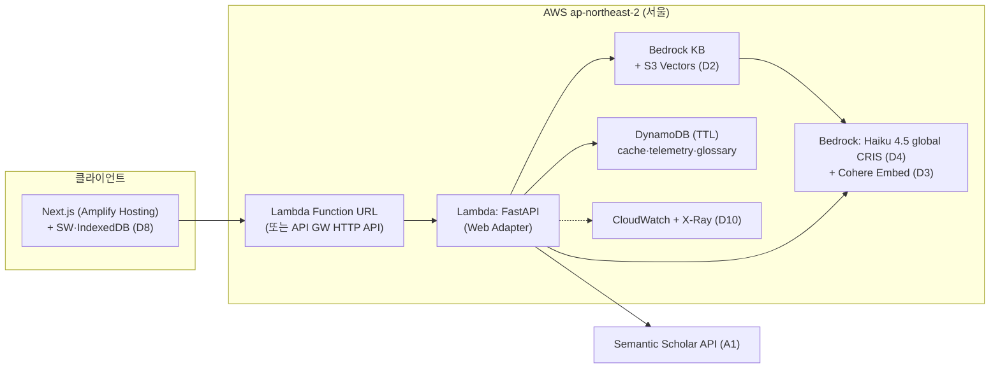

# DocSuri MVP — 기술 스택 후보 조사 (AWS 중심)

> **Phase**: AIDLC Construction — Architecture Decision Records *사전 조사*
> **지시** (사용자, 2026-06-10): D1~D10 결정은 보류하고, 후보를 **AWS 중심**으로 조사한다.
> **요구 근거**: [`handoff.md §4`](../story-artifacts/handoff.md) (D1~D10) · [`nfr.md`](../requirements/nfr.md) · [`component-model.md`](component-model.md) (포트 경계)
> **상태**: 🔍 조사 보고서 (스냅샷). **2026-06-10 이후 D1~D10 전 항목 확정됨** — 최종 결정·리전(도쿄)은 [`architecture_decision_record.md`](architecture_decision_record.md)가 단일 진실. 본 문서의 "권장"·"서울 기준" 표기는 조사 시점 기록으로 보존.
> **가격·가용성 기준일**: 2026-06-10 웹 확인 (출처 §15). AWS 가격·리전은 수시 변동 — ADR 확정 시 재검증 필요.

---

## 0. 요약 — 결정별 1순위 후보

| 결정 | AWS 중심 1순위 후보 | 핵심 근거 | 데모 월 비용 추정 |
|---|---|---|---|
| [D1](../story-artifacts/handoff.md#d-1) 백엔드 | **Python 3.12 + FastAPI** (Lambda Web Adapter 또는 App Runner 컨테이너) | LLM·PDF·임베딩 생태계 + 두 호스팅 모두 무수정 탑재 | 호스팅에 포함 |
| [D2](../story-artifacts/handoff.md#d-2) 임베딩 인덱스 | **Bedrock Knowledge Bases + S3 Vectors** (서울 GA) | 메타데이터 필터 내장(DISC-02), 인프라 0, 코퍼스 100편에 초저가 | < $1 |
| [D3](../story-artifacts/handoff.md#d-3) 임베딩 모델 | **Cohere Embed Multilingual v3** (Bedrock) | ko↔en 교차언어 + KB 지원 모델, $0.1/1M tok | < $1 |
| [D4](../story-artifacts/handoff.md#d-4) LLM | **Claude Haiku 4.5** (Bedrock, `global.` CRIS) | 한국어 톤 제어(UX-01·02) + 시뮬레이션 월 ~$42 ≤ $50 | ~$42 (지배 변수) |
| [D5](../story-artifacts/handoff.md#d-5) 프론트엔드 | **Next.js App Router + Amplify Hosting** | SSR 50만 req/월 무료 티어, URL 직렬화(DISC-02) | ~$0 |
| [D6](../story-artifacts/handoff.md#d-6) 컴포넌트 | **shadcn/ui + Tailwind** (AWS 중립 결정) | Radix 기반 WCAG AA(A11Y-01), 44px 타깃 직접 제어 | $0 |
| [D7](../story-artifacts/handoff.md#d-7) 그래프 | **React Flow** (AWS 중립 결정) | 노드=React 컴포넌트 → TRACE-01 "노드→논문 카드" 직결 | $0 |
| [D8](../story-artifacts/handoff.md#d-8) 오프라인 캐시 | **Service Worker(PWA) + IndexedDB** | SW 없이는 오프라인 재방문 불가 → NET-04 전제 조건 | $0 |
| [D9](../story-artifacts/handoff.md#d-9) 호스팅 | **(a) 서버리스 일괄** — Amplify + Lambda + KB + DynamoDB | 유휴 ~$0·운영 부담 최소. 대안 (b) App Runner 상시 | $0~3 (LLM 제외) |
| [D10](../story-artifacts/handoff.md#d-10) 관찰가능성 | **CloudWatch (EMF 메트릭) + Bedrock 호출 로깅 + X-Ray** | OBS-02 토큰·비용 누적이 Bedrock 로깅으로 자동화 | $0~2 |

> **합계 추정 (서버리스 + Haiku 4.5)**: 월 **~$45** — [NFR-COST-01](../requirements/nfr.md#nfr-cost-01) $50 이내. 상세 산식 §12.

---

## 1. 조사 전제 (aidlc-docs 근거 제약)

| 제약 | 출처 | 후보 선별에 미친 영향 |
|---|---|---|
| LLM 비용 월 $50 상한 | [NFR-COST-01](../requirements/nfr.md#nfr-cost-01) | OpenSearch Serverless(최소 ~$175/월) 탈락, Sonnet 단독 채택 곤란 |
| 검색 P50<3s·P95<6s / 모바일 P95<5s | [NFR-PERF-01](../requirements/nfr.md#nfr-perf-01)·[MOBILE-03](../requirements/nfr.md#nfr-mobile-03) | 콜드스타트(Lambda·Aurora 0 ACU resume)가 평가 항목화 |
| 오프라인 24h 읽기 전용 | [NFR-NET-04](../requirements/nfr.md#nfr-net-04) | D8은 클라이언트 기술이라 AWS 서비스로 대체 불가 |
| 출력 한국어·용어 일관 | [NFR-LANG-01](../requirements/nfr.md#nfr-lang-01)·[03](../requirements/nfr.md#nfr-lang-03) | LLM 한국어 톤 제어·다국어 임베딩 가중치 ↑ |
| 코퍼스 AI/ML 100편 시드 | [A5](../story-artifacts/handoff.md#a-5) · [U0 §6](units/unit-u0-foundation.md) | "수십만 벡터" 규모 솔루션은 전부 과설계 |
| 공개 API 데이터(arXiv·Semantic Scholar) + 익명 세션 | [A1](../story-artifacts/handoff.md#a-1)·[A2](../story-artifacts/handoff.md#a-2) | 데이터 주권 민감도 낮음 → `global.` CRIS 허용 가능 |
| 연도·분야 필터 | [US-DISC-02](../story-artifacts/user_stories.md#us-disc-02) | 벡터 스토어의 **메타데이터 필터 내장 여부**가 D2 1차 기준 |

**리전 전략 (조사 결과)** — 서울(ap-northeast-2) 단일 리전이 가능하다:

- S3 Vectors **서울·도쿄 모두 GA 리전 포함** (31개 리전 중).
- Bedrock 최신 Claude(4.5·4.6 계열)는 서울 소스에서 **`global.*` 교차 리전 추론(CRIS)** 프로필로 호출 (서울 전용 `us.*` 프로필 없음 주의, 일부 모델은 `apac.*` 제공). CRIS는 **추가 과금 없음** — 소스 리전 가격 기준.
- Amazon Nova 계열은 `apac.*` CRIS에 **서울 명시 포함**.
- CRIS 왕복 지연(수십 ms)은 LLM 호출 자체(수 초) 대비 무시 가능. 단, 요청이 글로벌 상용 리전으로 라우팅될 수 있음 — 공개 논문 데이터·익명 세션([A2](../story-artifacts/handoff.md#a-2))이라 수용 가능하나 ADR에 명시 필요.

---

## 2. D1 — 백엔드 언어/프레임워크

| 후보 | AWS 적합성 | 장점 | 리스크 |
|---|---|---|---|
| **Python 3.12 + FastAPI** ★ | Lambda(공식 [Web Adapter](https://github.com/awslabs/aws-lambda-web-adapter)로 무수정 탑재) / App Runner / EC2 모두 1급 지원 | boto3·PDF 추출(PyMuPDF/pdfplumber, [U2 §5](units/unit-u2-comprehend.md) 후보)·임베딩 생태계 최강 | Lambda 콜드스타트 ~1초대 (패키지 슬림화 필요) |
| Node.js (NestJS/Hono) | 동일 (Lambda 네이티브) | 프론트와 단일 언어, 콜드스타트 짧음 | PDF 추출·과학 텍스트 처리 생태계 약함 |
| Bun | Lambda 커스텀 런타임 필요 | 빠른 부팅 | AWS 관리형 런타임 아님 — 데모에 불필요한 모험 |

**권장(미확정)**: Python + FastAPI. 두 호스팅 안(§10의 a/b) 어느 쪽이든 동일 코드로 이동 가능 — D9 결정과 독립적으로 닫을 수 있는 결정.

---

## 3. D2 — 임베딩 인덱스

| 후보 | 데모 월 비용 | 메타데이터 필터(DISC-02) | 콜드스타트 | 판정 |
|---|---|---|---|---|
| **Bedrock KB + S3 Vectors** ★ | < $1 (스토리지 GB·쿼리 $2.5/백만 건) | **내장** (filterable metadata) | 없음 (관리형 API) | 서울 GA 확인. 인프라 0 |
| Aurora Serverless v2 + pgvector | ~$1~5 (0 ACU auto-pause + 스토리지) | SQL WHERE — 최강 | **resume ~15초** — 첫 검색 P50<3s 위반 위험 | auto-pause 시간 조정 또는 워밍 필요 |
| OpenSearch Serverless | **최소 ~$175** (dev 비중복 1 OCU) | 내장 | 없음 | **[NFR-COST-01](../requirements/nfr.md#nfr-cost-01) 탈락** |
| RDS t4g.micro + pgvector | ~$12~15 | SQL WHERE | 없음 | 상시 과금 — (b)안과 묶을 때만 고려 |
| (비-AWS 참고) Chroma 임베디드 | $0 | 내장 | 없음 | (b) 컨테이너 안에서만 가능 — Lambda 디스크 비영속 |

**권장(미확정)**: Bedrock KB + S3 Vectors. [컴포넌트 모델 §2.1](component-model.md)의 `EmbeddingPort.embed/search`가 KB `Retrieve` API 1회로 구현되고, 코퍼스 적재(CorpusIndex 1회 빌드, [A1](../story-artifacts/handoff.md#a-1))는 S3 업로드 + KB 동기화로 끝난다. 청킹·임베딩 호출도 KB가 관리.

---

## 4. D3 — 임베딩 모델 (Bedrock 제공 중 KB 호환)

| 후보 | 가격/1M tok | 한국어 | 비고 |
|---|---|---|---|
| **Cohere Embed Multilingual v3** ★ | ~$0.10 | **교차언어(ko↔en) 강함** | KB 지원. [DISC-04](../story-artifacts/user_stories.md#us-disc-04) 한국어 직접 질의의 안전망 |
| Titan Text Embeddings V2 | ~$0.02 | 다국어 100+ (영어 최적화) | KB 기본. 최저가 |
| (비-AWS 참고) OpenAI text-embedding-3-small | ~$0.02 | 보통 | AWS 외부 의존 +1 — AWS 중심 조사에서 후순위 |

**완화 요인**: [컴포넌트 모델 §3.2](component-model.md) `KoEnQueryMapper`가 한국어 질의를 영문 키워드로 매핑한 *뒤* 검색하므로(DISC-04 AC가 매핑 표시를 이미 요구) 교차언어 성능 의존이 줄어든다. 그래도 매퍼 실패 시 폴백을 고려하면 다국어 모델이 안전하고, 비용 차이는 월 기준 무시 가능(< $1).

**권장(미확정)**: Cohere Embed Multilingual v3.

---

## 5. D4 — LLM 모델 (Bedrock)

| 후보 | 가격 in/out per 1M | 한국어 톤 제어 (UX-01 KKL4급 / UX-02 어휘 보존) | 시뮬 월비용(§12 트래픽) | 판정 |
|---|---|---|---|---|
| **Claude Haiku 4.5** ★ | $1 / $5 | 우수 | **~$42** | $50 이내, 품질·비용 균형 |
| Amazon Nova Lite | $0.06 / $0.24 | 보통 — KKL 4급 수준 조절 검증 필요 | ~$2 | 비용 바닥. 품질 PoC 후 채택 가능 |
| Claude Sonnet 4.6 | $3 / $15 | 최상 | ~$126 | **단독 채택 시 예산 초과** |
| 혼합 라우팅: Haiku(요약·번역) + Sonnet(DIFF만) | — | DIFF-01·02 novelty 평가만 상급 모델 | ~$43 | `LlmPort` 게이트웨이 라우팅으로 구현 가능 — R2·R3와 정합 |

- 서울 소스 → `global.anthropic.claude-haiku-4-5-*` CRIS 호출 (추가 과금 없음). Nova는 `apac.amazon.nova-lite-*`.
- [컴포넌트 모델 §2.2](component-model.md) `CostGuard`가 상한을 강제하므로 어떤 선택이든 $50을 *넘을 수 없게* 만든다 — 모델 선택은 "상한 내 품질" 문제.
- Bedrock **모델 호출 로깅**을 켜면 토큰 수가 CloudWatch에 자동 기록 → [NFR-OBS-02](../requirements/nfr.md#nfr-obs-02)·D10과 시너지.

**권장(미확정)**: Claude Haiku 4.5 기본 + (선택) DIFF 한정 Sonnet 혼합 라우팅. 비용 최우선이면 Nova Lite로 PoC.

---

## 6. D5 — 프론트엔드 프레임워크 + 배포

| 후보 | AWS 적합성 | 무료 티어 | 비고 |
|---|---|---|---|
| **Next.js App Router + Amplify Hosting** ★ | SSR 공식 지원 | 빌드 1,000분 + 15GB 전송 + **SSR 50만 req/월** | URL 쿼리 직렬화(DISC-02)·RSC 스트리밍(4G [NFR-MOBILE-03](../requirements/nfr.md#nfr-mobile-03))·react-flow(D7) 결합 |
| Next.js 정적 export + S3 + CloudFront | 가장 저렴·단순 | 사실상 $0 | SSR 포기 — 데이터가 전부 클라이언트 fetch라면 성립. 초기 로드 성능은 SSR 대비 손해 |
| SvelteKit + Amplify | 지원됨 | 동일 | react-flow 불가 → D7 연쇄 재검토 |
| (비-AWS 참고) Vercel | — | Hobby 무료 | AWS 일원화 이탈 |

**권장(미확정)**: Next.js + Amplify Hosting. 데모 트래픽은 무료 티어 내 ~$0.

---

## 7. D6 — 컴포넌트 라이브러리

AWS 자체 디자인 시스템 **Cloudscape**가 존재하지만 *관리 콘솔용*(데스크톱 위주, 정보 밀도 높음)이라 모바일 소비자 앱([NFR-MOBILE-01·02](../requirements/nfr.md#nfr-mobile-01)·바텀시트 [A8](../story-artifacts/handoff.md#a-8))에 부적합 — **이 결정은 AWS 중립으로 두는 것이 타당**하다.

| 후보 | A11y (WCAG 2.1 AA, [NFR-A11Y-01](../requirements/nfr.md#nfr-a11y-01)) | 모바일 패턴 | 비고 |
|---|---|---|---|
| **shadcn/ui + Tailwind** ★ | Radix 프리미티브 | vaul 바텀시트, 44px 직접 제어 | 코드 소유 — 커스텀 자유 |
| Mantine | 양호 | 보통 | 스타일 시스템 별도 |
| Chakra UI | 양호 | 보통 | 런타임 CSS-in-JS — 4G 초기 로드 불리 |
| AWS Cloudscape | 양호 | **약함** | 콘솔 UX — 본 제품 톤과 불일치 |

**권장(미확정)**: shadcn/ui + Tailwind CSS.

---

## 8. D7 — 그래프 시각화 ([US-TRACE-01](../story-artifacts/user_stories.md#us-trace-01) 데스크톱 전용)

AWS에 해당 관리형 서비스 없음 — 클라이언트 라이브러리 결정 (AWS 중립).

| 후보 | ≤30 노드 적합성 | "노드 → 논문 카드" AC | 키보드 내비([NFR-A11Y-02](../requirements/nfr.md#nfr-a11y-02)) |
|---|---|---|---|
| **React Flow** ★ | 최적 | 노드=React 컴포넌트 — 직결 | 내장 |
| Cytoscape.js | 양호 | 캔버스 렌더 — 카드 UI 별도 구현 | 수동 |
| Sigma.js | 과설계(수천 노드용 WebGL) | 어려움 | 수동 |

**권장(미확정)**: React Flow — 단 D5가 React 계열일 때만 성립 (결정 연쇄: D5 → D7).

---

## 9. D8 — 오프라인 캐시 ([NFR-NET-04](../requirements/nfr.md#nfr-net-04))

클라이언트 기술이라 AWS 서비스로 대체 불가 (CloudFront는 *서버측* 캐시 — 오프라인 재방문엔 무력).

| 후보 | 오프라인 **재방문** 가능 | 24h TTL 데이터 | 판정 |
|---|---|---|---|
| **Service Worker(PWA) + IndexedDB** ★ | ✅ 앱 셸 캐시 | IndexedDB + 타임스탬프 TTL | NET-04 완전 충족. Next.js는 Serwist로 결합 |
| IndexedDB 단독 | ❌ 열린 탭에서만 | 가능 | 부분 충족 |
| localStorage 단독 | ❌ + 5MB 한도·동기 API | 제한적 | 최후 폴백 |

**권장(미확정)**: SW(Serwist) + IndexedDB. Amplify Hosting 정적 자산 배포와 충돌 없음.

---

## 10. D9 — 호스팅: 참조 아키텍처 2안

### (a) 풀 서버리스 ★ — 유휴 ~$0

- `CachePort` → **DynamoDB TTL 속성**(24h/7d 자동 만료, [NFR-DATA-03](../requirements/nfr.md#nfr-data-03)) · `Telemetry` → DynamoDB(누적 질의용) + CloudWatch EMF · `Glossary` 50개 → DynamoDB 또는 Lambda 메모리.
- 콜드스타트 ~1-2s는 첫 호출만 — P50(중앙값)은 warm 경로가 지배해 [NFR-PERF-01](../requirements/nfr.md#nfr-perf-01) 충족 가능. 불안하면 EventBridge 5분 핑.

### (b) 상시 컨테이너 — 콜드 0, 고정비 소액

App Runner(0.25 vCPU/0.5GB: 유휴 ~$3 + 활성 분량, 1 vCPU/2GB: ~$10-13) 또는 EC2 t4g.micro(~$7). FastAPI + **Chroma 파일 + SQLite**(컴포넌트 모델의 파일 기반 포트 그대로) → 코드 가장 단순. 프론트는 동일하게 Amplify.

| 비교 | (a) 서버리스 | (b) 컨테이너 |
|---|---|---|
| 유휴 비용 | ~$0 | $3~13/월 |
| 콜드스타트 | ~1-2s (첫 호출) | 없음 |
| 운영 부담 | 최소 (전부 관리형) | 컨테이너·디스크 관리 |
| D2 결합 | KB+S3 Vectors 자연 결합 | Chroma/pgvector 자유 |
| 데모 항상성 | 무료 티어 영구 | 상시 과금 |

**권장(미확정)**: (a) 서버리스 일괄. 자체 VPS(handoff 후보 3안)는 TLS·배포 수동 부담으로 후순위.

---

## 11. D10 — 관찰가능성 ([NFR-OBS-01·02](../requirements/nfr.md#nfr-obs-01))

| 후보 | OBS-01 (latency·토큰·캐시 적중) | OBS-02 (토큰·비용 누적) | 비용 |
|---|---|---|---|
| **CloudWatch Logs(EMF) + Bedrock 모델 호출 로깅 + X-Ray** ★ | EMF 커스텀 메트릭 + 구조화 로그 | Bedrock 로깅이 토큰 자동 기록, 누적치는 DynamoDB(CostGuard 동일 저장소) | 데모 ~$0-2 (프리 티어 내) |
| Sentry | 에러 추적 강점 | 토큰·비용 비네이티브 | 무료 티어 |
| OpenTelemetry + Grafana Cloud | 표준·이식성 | 직접 구현 | 설정 비용 큼 |

**권장(미확정)**: CloudWatch 일괄 + DynamoDB 비용 누적. `Telemetry.record()` 1회 호출 → EMF 1행 + DynamoDB 1행.

---

## 12. 비용 시뮬레이션 ([NFR-COST-01](../requirements/nfr.md#nfr-cost-01) — U0 §6 시뮬레이션 보고 선행)

**데모 트래픽 가정** (30일): 일 검색 100건(캐시 미스 50) · 신규 요약 50건 · 부분 번역 100건 · DIFF 분석 10건 · 키워드 확장/매핑 50건 · 시각자료 설명 30건.

| 항목 | 산식 (Haiku 4.5: $1 in / $5 out per 1M tok) | 월 |
|---|---|---|
| 요약 (COMP-01·03) | 50건/일 × (8k in + 1k out) = $0.65/일 | $19.5 |
| 부분 번역 (COMP-04) | 100건/일 × (0.5k + 0.5k) = $0.30/일 | $9.0 |
| DIFF-01·02 | 10건/일 × [5편×(3k+0.3k) + 종합(6k+0.8k)] ≈ $0.33/일 | $9.8 |
| 확장·매핑·캡션 (DISC-03·04, COMP-05) | ≈ $0.13/일 | $3.9 |
| **LLM 소계** | | **~$42** |
| 임베딩 (Cohere, 쿼리+코퍼스 1회) | ≪ $1 | ~$0 |
| S3 Vectors + DynamoDB + Lambda + Amplify + CloudWatch | 전부 프리 티어/최소 과금 | $0~3 |
| **(a) 총계** | | **~$45 ✅** |
| (b) 총계 — App Runner 추가 시 | +$3~13 | ~$48~58 ⚠️ 경계 |
| 참고: Nova Lite로 교체 | LLM 소계 ~$2 | 총 ~$5 |
| 참고: 혼합(Haiku + DIFF만 Sonnet 4.6) | LLM 소계 ~$43 | 총 ~$46 |

- 캐시(24h 검색·7d 요약, [NFR-DATA-03](../requirements/nfr.md#nfr-data-03)) 적중 시 위 수치보다 내려간다 — 위는 *미스 기준 보수 추정*.
- 어떤 안이든 `CostGuard` 상한이 하드 스톱 — 초과 자체가 불가능한 구조가 ADR의 전제.

---

## 13. 포트 ↔ AWS 후보 매핑 ([컴포넌트 모델 §2](component-model.md) 연결)

| U0 포트/정책 | (a) 서버리스 후보 | (b) 컨테이너 후보 |
|---|---|---|
| `EmbeddingPort.embed/search` | Bedrock KB Retrieve (+Cohere Embed) | Bedrock 직접 호출 + Chroma |
| `LlmPort.complete` + `CostGuard` | Bedrock Converse API + DynamoDB 누적 | 동일 + SQLite 누적 |
| `CachePort` | DynamoDB TTL | SQLite/Chroma 파일 + 디스크 |
| `SessionPort` | 클라이언트 쿠키/URL (서버 무상태) | 동일 |
| `Telemetry` | CloudWatch EMF + DynamoDB | 구조화 로그 + SQLite |
| `Glossary` | DynamoDB 50행 | SQLite/JSON |
| `CitationApi` (R4 캐시·폴백) | Lambda → Semantic Scholar + DynamoDB 캐시 | FastAPI → 동일 + SQLite 캐시 |
| `HttpClientPolicy` | httpx 재시도 정책 (코드 레벨) | 동일 |

---

## 14. 결정 연쇄와 다음 단계

- 독립적으로 닫을 수 있음: D1, D6, D8, D10.
- 연쇄: **D9(a/b) → D2** (서버리스면 KB+S3 Vectors, 컨테이너면 Chroma/pgvector도 가능) · **D5 → D7** (React 전제) · **D4 ↔ NFR-COST** (모델 선택이 예산 지배).
- 다음 단계: 본 보고서 검토 → [`adr_plan.md`](../plans/adr_plan.md) C-D1~C-D10 결정 게이트 재개 → ADR 작성(A1~A3).

## 15. 출처 (2026-06-10 확인)

- S3 Vectors GA: [AWS News Blog](https://aws.amazon.com/blogs/aws/amazon-s3-vectors-now-generally-available-with-increased-scale-and-performance/) · [리전 17개 추가](https://aws.amazon.com/about-aws/whats-new/2026/03/s3-vectors-expands-17-regions/) · [리전·쿼터 문서 (서울·도쿄 포함 확인)](https://docs.aws.amazon.com/AmazonS3/latest/userguide/s3-vectors-regions-quotas.html) · [S3 요금](https://aws.amazon.com/s3/pricing/)
- Bedrock 교차 리전 추론: [추론 프로필 문서](https://docs.aws.amazon.com/bedrock/latest/userguide/inference-profiles-support.html) · [Claude Haiku 4.5 모델 카드](https://docs.aws.amazon.com/bedrock/latest/userguide/model-card-anthropic-claude-haiku-4-5.html) · [JP/AU CRIS 발표](https://aws.amazon.com/blogs/machine-learning/introducing-amazon-bedrock-cross-region-inference-for-claude-sonnet-4-5-and-haiku-4-5-in-japan-and-australia/) · [APAC Global CRIS 확대](https://aws.amazon.com/blogs/machine-learning/global-cross-region-inference-for-latest-anthropic-claude-opus-sonnet-and-haiku-models-on-amazon-bedrock-in-thailand-malaysia-singapore-indonesia-and-taiwan/)
- Nova APAC(서울 포함): [What's New](https://aws.amazon.com/about-aws/whats-new/2025/02/amazon-nova-understanding-models-europe-asia-pacific/)
- OpenSearch Serverless 최소 비용: [요금 페이지](https://aws.amazon.com/opensearch-service/pricing/)
- Aurora Serverless v2 0 ACU: [auto-pause 문서](https://docs.aws.amazon.com/AmazonRDS/latest/AuroraUserGuide/aurora-serverless-v2-auto-pause.html) · [발표 블로그](https://aws.amazon.com/blogs/database/introducing-scaling-to-0-capacity-with-amazon-aurora-serverless-v2/)
- App Runner 요금: [요금 페이지](https://aws.amazon.com/apprunner/pricing/)
- Amplify Hosting: [요금](https://aws.amazon.com/amplify/pricing/) · [Next.js SSR 요금 문서](https://docs.aws.amazon.com/en_us/amplify/latest/userguide/nextjs-ssr-pricing.html) · [Next.js 지원](https://docs.aws.amazon.com/amplify/latest/userguide/ssr-amplify-support.html)
- Bedrock KB 지원 모델·스토어: [문서](https://docs.aws.amazon.com/bedrock/latest/userguide/knowledge-base-supported.html)
