# 에이전트 채팅 프론트엔드 Workflow Plan

## 분석 요약

- **범위**: `/agent` 프론트엔드 route, 모바일 하단 네비/데스크톱 상단 네비, 모드 선택/고정, 세션 drawer, 멀티턴 채팅, 파일 첨부, 진행 timeline, mock/real transport 경계.
- **사용자 영향**: 직접 영향. P1/P2가 새 Agent 채팅 화면을 사용한다.
- **구조 변경**: 프론트엔드 route와 상태 관리가 추가된다. backend API는 기존 novelty/session API와 향후 evidence API seam을 소비한다.
- **데이터 모델 변경**: v1 프론트 작업 자체는 신규 DB schema를 요구하지 않는다.
- **API 변경**: 프론트 transport seam 정의는 필요하지만, 새 backend API 구현은 별도 범위로 둔다.
- **NFR 영향**: 인증/owner scope, 첨부 검증, 저하 상태, PBT 후보가 있다.
- **위험도**: Medium. UI touchpoint가 많지만 기존 Next.js frontend 패턴을 재사용한다.

## 실행 판정

### INCEPTION

- [x] Requirements Analysis — 완료. FR-40~43, NFR-P7, QT-11 반영.
- [x] User Stories — 완료. 에픽 11, US-AG1..AG7 생성.
- [x] Workflow Planning — 완료. 이 문서.
- [ ] Application Design — EXECUTE.
  - **이유**: Agent 화면의 컴포넌트 경계, 상태 reducer, transport seam, responsive/preview 동작을 정해야 한다.
- [ ] Units Generation — SKIP.
  - **이유**: U13 단일 프론트엔드 유닛으로 충분하다. backend adapter/API 확장은 별도 유닛에서 다룬다.

### CONSTRUCTION

- [ ] Functional Design — EXECUTE.
  - **이유**: 세션 상태, mode lock, timeline event, 첨부 allowlist, response classifier 규칙이 필요하다.
- [ ] NFR Requirements — EXECUTE.
  - **이유**: 인증, 첨부 검증, degraded UX, PBT 범위를 고정해야 한다.
- [ ] NFR Design — EXECUTE.
  - **이유**: reducer/helper PBT, error classifier, preview iframe 호환 설계가 필요하다.
- [ ] Infrastructure Design — SKIP.
  - **이유**: v1 프론트 구현은 기존 frontend 배포를 재사용한다.
- [ ] Code Generation — EXECUTE.
- [ ] Build and Test — EXECUTE.

## Workflow Visualization

```mermaid
flowchart TD
    Start(["Agent Chat Frontend"])
    RA["Requirements Analysis<br/><b>COMPLETED</b>"]
    US["User Stories<br/><b>COMPLETED</b>"]
    WP["Workflow Planning<br/><b>COMPLETED</b>"]
    AD["Application Design<br/><b>EXECUTE</b>"]
    UG["Units Generation<br/><b>SKIP</b>"]
    FD["Functional Design<br/><b>EXECUTE</b>"]
    NFRA["NFR Requirements<br/><b>EXECUTE</b>"]
    NFRD["NFR Design<br/><b>EXECUTE</b>"]
    ID["Infrastructure Design<br/><b>SKIP</b>"]
    CG["Code Generation<br/><b>EXECUTE</b>"]
    BT["Build and Test<br/><b>EXECUTE</b>"]
    End(["Complete"])

    Start --> RA --> US --> WP --> AD --> UG --> FD --> NFRA --> NFRD --> ID --> CG --> BT --> End

    style RA fill:#4CAF50,stroke:#1B5E20,stroke-width:3px,color:#fff
    style US fill:#4CAF50,stroke:#1B5E20,stroke-width:3px,color:#fff
    style WP fill:#4CAF50,stroke:#1B5E20,stroke-width:3px,color:#fff
    style AD fill:#FFA726,stroke:#E65100,stroke-width:3px,stroke-dasharray: 5 5,color:#000
    style UG fill:#BDBDBD,stroke:#424242,stroke-width:2px,stroke-dasharray: 5 5,color:#000
    style FD fill:#FFA726,stroke:#E65100,stroke-width:3px,stroke-dasharray: 5 5,color:#000
    style NFRA fill:#FFA726,stroke:#E65100,stroke-width:3px,stroke-dasharray: 5 5,color:#000
    style NFRD fill:#FFA726,stroke:#E65100,stroke-width:3px,stroke-dasharray: 5 5,color:#000
    style ID fill:#BDBDBD,stroke:#424242,stroke-width:2px,stroke-dasharray: 5 5,color:#000
    style CG fill:#4CAF50,stroke:#1B5E20,stroke-width:3px,color:#fff
    style BT fill:#4CAF50,stroke:#1B5E20,stroke-width:3px,color:#fff
```

## 다음 단계

- `aidlc-docs/inception/plans/agent-chat-frontend-application-design-plan.md` 질문 답변 확정.
