# 실행 계획 (Execution Plan)

**단계**: INCEPTION → Workflow Planning · **일자**: 2026-06-15 · **프로젝트 유형**: Greenfield

## 상세 분석 요약

### 변경 영향 평가 (Change Impact Assessment)
- **사용자 대면 변경**: 예 — 제품 전체가 신규 사용자 대면(디스커버리 UI, 계정, 라이브러리).
- **구조 변경**: 예 — 신규 풀스택 아키텍처(인제스천 파이프라인 + 검색 서비스 + 모바일 웹 + 계정).
- **데이터 모델 변경**: 예 — 신규 스키마(논문/임베딩, 사용자, 검색 저장/라이브러리/이력).
- **API 변경**: 예 — 신규 엔드포인트(검색, 인증, 저장 데이터).
- **NFR 영향**: 예 — 성능(P50<3s), 보안/인증, 확장성/비용 상한, 신뢰성/우아한 저하, 관측성.

### 리스크 평가 (Risk Assessment)
- **리스크 수준**: 중간~높음(Medium–High) — 공개 프로덕션·신규 시스템이나 단일 앵커(디스커버리) MVP로 잘 한정됨.
- **롤백 복잡도**: 보통 — git-flow + IaC 재배포(RES-2, RES-4는 NFR Design에서 확정).
- **테스트 복잡도**: 보통~복잡 — 엄격 근거화 평가셋(QT-1/2), PBT(QT-4), 우아한 저하(QT-3).

> Greenfield이므로 브라운필드 전용 항목(변환 범위, 컴포넌트 관계도, 모듈 조정)은 N/A.

## 워크플로 시각화

```mermaid
flowchart TD
    Start(["사용자 요청"])

    subgraph INCEPTION["🔵 INCEPTION"]
        WD["워크스페이스 탐지<br/><b>완료</b>"]
        RE["리버스 엔지니어링<br/><b>건너뜀</b>"]
        RA["요구사항 분석<br/><b>완료</b>"]
        US["사용자 스토리<br/><b>완료</b>"]
        WP["워크플로 계획<br/><b>진행</b>"]
        AD["애플리케이션 설계<br/><b>실행</b>"]
        UG["유닛 생성<br/><b>실행</b>"]
    end

    subgraph CONSTRUCTION["🟢 CONSTRUCTION"]
        FD["기능 설계<br/><b>실행</b>"]
        NFRA["NFR 요구사항<br/><b>실행</b>"]
        NFRD["NFR 설계<br/><b>실행</b>"]
        IDS["인프라 설계<br/><b>실행</b>"]
        CG["코드 생성<br/><b>실행</b>"]
        BT["빌드 & 테스트<br/><b>실행</b>"]
    end

    subgraph OPERATIONS["🟡 OPERATIONS"]
        OPS["운영<br/><b>플레이스홀더</b>"]
    end

    Start --> WD --> RE --> RA --> US --> WP
    WP --> AD --> UG
    UG --> FD --> NFRA --> NFRD --> IDS --> CG --> BT
    BT --> OPS --> Done(["완료"])

    style WD fill:#4CAF50,stroke:#1B5E20,stroke-width:3px,color:#fff
    style RA fill:#4CAF50,stroke:#1B5E20,stroke-width:3px,color:#fff
    style US fill:#4CAF50,stroke:#1B5E20,stroke-width:3px,color:#fff
    style WP fill:#FFA726,stroke:#E65100,stroke-width:3px,color:#000
    style AD fill:#FFA726,stroke:#E65100,stroke-width:3px,stroke-dasharray: 5 5,color:#000
    style UG fill:#FFA726,stroke:#E65100,stroke-width:3px,stroke-dasharray: 5 5,color:#000
    style FD fill:#FFA726,stroke:#E65100,stroke-width:3px,stroke-dasharray: 5 5,color:#000
    style NFRA fill:#FFA726,stroke:#E65100,stroke-width:3px,stroke-dasharray: 5 5,color:#000
    style NFRD fill:#FFA726,stroke:#E65100,stroke-width:3px,stroke-dasharray: 5 5,color:#000
    style IDS fill:#FFA726,stroke:#E65100,stroke-width:3px,stroke-dasharray: 5 5,color:#000
    style CG fill:#4CAF50,stroke:#1B5E20,stroke-width:3px,color:#fff
    style BT fill:#4CAF50,stroke:#1B5E20,stroke-width:3px,color:#fff
    style RE fill:#BDBDBD,stroke:#424242,stroke-width:2px,stroke-dasharray: 5 5,color:#000
    style OPS fill:#FFF59D,stroke:#F9A825,stroke-width:2px,color:#000
    style Start fill:#CE93D8,stroke:#6A1B9A,stroke-width:3px,color:#000
    style Done fill:#CE93D8,stroke:#6A1B9A,stroke-width:3px,color:#000

    linkStyle default stroke:#333,stroke-width:2px
```

## 실행할 단계 (Phases to Execute)

### 🔵 INCEPTION 단계
- [x] 워크스페이스 탐지 (완료)
- [x] 리버스 엔지니어링 (건너뜀 — Greenfield)
- [x] 요구사항 분석 (완료)
- [x] 사용자 스토리 (완료·승인)
- [x] 워크플로 계획 (진행 중 — 본 문서)
- [ ] **애플리케이션 설계 — 실행(EXECUTE)**
  - **근거**: 신규 컴포넌트/서비스(검색·랭킹·근거화, 인제스천, 계정, 사용자 데이터, 모바일 웹)와 컴포넌트 메서드·비즈니스 규칙·의존성 정의 필요.
- [ ] **유닛 생성 — 실행(EXECUTE)**
  - **근거**: 시스템을 다수 유닛으로 분해 필요. 예비 분해(유닛 생성에서 확정): U1 인제스천·인덱싱, U2 디스커버리/검색 API, U3 계정·인증, U4 검색 저장·라이브러리, U5 모바일 웹 프런트엔드, U6 신뢰성·운영(관측성·비용 가드·AI 인시던트 탐지; 횡단 가능).

### 🟢 CONSTRUCTION 단계 (유닛별 루프)
- [ ] **기능 설계 — 실행(EXECUTE)**
  - **근거**: 신규 데이터 모델/스키마, 복잡 비즈니스 로직(검색 랭킹, 근거화/기권, 비용 서킷 브레이커). PBT-01 속성 식별도 여기서 시작.
- [ ] **NFR 요구사항 — 실행(EXECUTE)**
  - **근거**: 성능·보안·확장성·비용 요구 존재, 기술 스택 선정 필요(PBT 프레임워크 선정 포함).
- [ ] **NFR 설계 — 실행(EXECUTE)**
  - **근거**: NFR 요구사항 실행됨 → NFR 패턴 반영. 보류된 Resiliency 결정(CI/CD·롤백·배포 방식 RES-4, 복원력 테스트 RES-12)이 여기서 확정. _(ID 정정 2026-06-16: RES-14→RES-12, SSOT requirements.md §7.)_
- [ ] **인프라 설계 — 실행(EXECUTE)**
  - **근거**: AWS 자원 명세(벡터 스토어, 컴퓨트, DB, 호스팅), 배포 아키텍처, 리전/AZ 토폴로지(RES-2) 확정. _(ID 정정 2026-06-16: 토폴로지=RES-2; RES-8은 오토스케일링/쿼터.)_
- [ ] **코드 생성 — 실행(EXECUTE, 항상)**
  - **근거**: 구현 계획 + 코드/테스트 생성.
- [ ] **빌드 & 테스트 — 실행(EXECUTE, 항상)**
  - **근거**: 빌드·단위/통합 테스트·검증.

### 🟡 OPERATIONS 단계
- [ ] 운영 — 플레이스홀더 (향후 배포·모니터링 워크플로)

## 추정 일정 (Estimated Timeline) - 병렬 개발 조율 반영 (2026-06-16)
- **준비 단계**: `shared/` 공용 규약 패키지 선행 설계 및 작성.
- **CONSTRUCTION 개발 단계 (3개 병렬 트랙)**:
  * **Track 1**: U1 Ingestion ──> U6 Reliability/Ops (데이터 및 탐지 파이프라인)
  * **Track 2**: U3 Accounts ──> U4 Library (회원 관리 및 개인화 데이터)
  * **Track 3**: U2 Discovery (Mock API 활용 선행) ──> U5 Frontend (UI 및 클라이언트 구현)
- 각 유닛은 CONSTRUCTION 유닛별 루프(Functional -> NFR Req -> NFR Design -> Infra Design -> CodeGen -> Build & Test)를 병렬 진행합니다.

## 성공 기준 (Success Criteria)
- **주 목표**: 매직 모먼트(자연어 의도 → 폰에서 수초 내 근거화된 arXiv 결과)를 충족하는 프로덕션급 디스커버리 MVP.
- **핵심 산출물**: 인제스천 파이프라인, 디스커버리/검색 API(엄격 근거화), 계정, 검색 저장/라이브러리, 모바일 웹 UI(폰 목업 프레임), 관측성·비용 가드·AI 인시던트 탐지.
- **품질 게이트**: 날조 인용 0건(QT-1), 관련도 평가셋(QT-2), 우아한 저하(QT-3), PBT(QT-4), 활성 확장(Security/Resiliency/PBT) 각 단계 준수.

---

# Cohere Embed v4.0 Migration Execution Plan

**일자**: 2026-06-23 · **프로젝트 유형**: Brownfield (Migration)

## 1. 상세 분석 요약

### 변경 영향 평가 (Change Impact Assessment)
- **사용자 대면 변경**: 아니오 (백엔드 모델 및 인덱스 업그레이드만 진행. 단, 검색 품질은 개선됨)
- **구조 변경**: 아니오
- **데이터 모델 변경**: 아니오 (인덱스 매핑은 동일하나 벡터 차원만 다름)
- **API 변경**: 아니오 (API 계약은 동일)
- **NFR 영향**: 예 — NFR-M2 (Blue/Green 무중단 마이그레이션), NFR-S2 (v4 모델 컷오버)

### 리스크 평가 (Risk Assessment)
- **리스크 수준**: 중간(Medium) — 신규 인덱스 전환 시나리오에 따른 데이터 누락 및 듀얼 라이트 문제 발생 가능성.
- **롤백 복잡도**: 쉬움(Easy) — 문제 발생 시 기존 `docsuri-corpus-v1` 인덱스(alias)로 즉시 롤백 가능.

## 2. 모듈 간 조정 분석 (Multi-Module Coordination Analysis)

- **Update Approach**: Sequential/Hybrid
- **Sequence**:
  1. **Infrastructure**: 신규 v4 인덱스(`docsuri-corpus-v2`) 생성 및 Alias 구성.
  2. **U1 Ingestion (Code Gen)**: v4 모델 호출 로직 추가 및 v3, v4 듀얼 라이트(Dual-write) 구현.
  3. **Operations (Code Gen)**: 기존 v3 데이터 전체를 v4 모델로 재임베딩하여 v2 인덱스에 백필(Backfill)하는 마이그레이션 스크립트.
  4. **U2 Discovery (Code Gen)**: 검색 API가 v4 모델을 사용하도록 컷오버(Instant Cutover).

## 3. 실행할 단계 (Phases to Execute)

### 🔵 INCEPTION 단계
- [x] 워크스페이스 탐지 (완료)
- [x] 요구사항 분석 (완료)
- [x] 사용자 스토리 (건너뜀 — 기술적 마이그레이션)
- [x] 워크플로 계획 (진행 중 — 본 문서)
- [ ] 애플리케이션 설계 — **건너뜀(SKIP)** (신규 기능 없음)
- [ ] 유닛 생성 — **건너뜀(SKIP)** (신규 유닛 없음)

### 🟢 CONSTRUCTION 단계 (Migration Track)
- [ ] 기능 설계 — **건너뜀(SKIP)** (비즈니스 로직 없음)
- [ ] NFR 요구사항 — **건너뜀(SKIP)** (요구사항 분석에서 확정)
- [ ] **NFR 설계 — 실행(EXECUTE)**
  - **근거**: Blue/Green 마이그레이션, 듀얼 라이트, 백필 재임베딩 스크립트 전략 확정.
- [ ] **인프라 설계 — 실행(EXECUTE)**
  - **근거**: 신규 인덱스(v2) 셋업 및 Alias 전환 방식 설계.
- [ ] **코드 생성 — 실행(EXECUTE, 항상)**
  - **근거**: 인덱스 생성, 듀얼 라이트, 마이그레이션 스크립트, v4 컷오버 로직 구현.
- [ ] **빌드 & 테스트 — 실행(EXECUTE, 항상)**
  - **근거**: 마이그레이션 스크립트 테스트 및 듀얼 라이트 검증.
