# U1 Corpus 실행 계획

**단계**: INCEPTION -> Workflow Planning  
**일자**: 2026-06-26  
**입력**: 재인셉션 차터 D6, `requirements.md` U1 Corpus 개정, `stories.md` 에픽 4 개정, 코드 베이스라인 1차 패스

## 상세 분석 요약

### 변경 범위
- **Transformation type**: Brownfield, existing U1 Ingestion expansion.
- **Primary component**: `ingestion/`.
- **Related components**: `shared/dtos`, `shared/vector-spec`, `ops/cdk`, `backend/modules/discovery`, `backend/modules/summarization`, `shared/ports`.
- **Main change**: arXiv-only/full-text indexing -> multi-source Corpus + eager DocModel + DocModel(Block) indexing.

### 영향 평가
- **User-facing changes**: Indirect. Search, summary, translation, and agents get broader and better-grounded Corpus data.
- **Structural changes**: Yes. New source adapters, GROBID path, DocModel-first indexing, scheduler/retry/DLQ surface.
- **Data changes**: Yes. Source-level provenance, source watermarks, `(paperId, version)` DocModel/index/S3 consistency.
- **API changes**: No required public API change. U2 may need alias/config updates only.
- **NFR impact**: High. Eager build cost, retry/DLQ, source quotas, rebuild/reindex, observability, PBT invariants.

### 리스크
- **Risk level**: High.
- **Rollback complexity**: Moderate. Keep old index alias until DocModel generation/index generation is verified.
- **Testing complexity**: Complex enough to require PBT and integration checks, but scoped to U1 plus index consumers.

## 컴포넌트 관계

| Component | Change | Priority | Reason |
|---|---|---:|---|
| `shared/dtos` / `shared/vector-spec` | Minor, only if index record needs Block anchors/provenance fields | 1 | Contract must be stable before U1 writes and U2 reads. |
| `ingestion/` | Major | 2 | Main U1 Corpus pipeline implementation. |
| `ops/cdk` | Major | 3 | Scheduler, queue/DLQ, GROBID/runtime capacity, IAM/env wiring. |
| `backend/modules/discovery` | Minor | 4 | Read new alias/generation; API contract unchanged. |
| `backend/modules/summarization` | Minor | 4 | Lazy build queue becomes rebuild/backfill fallback. |
| `shared/ports` | Minor | 4 | ObservabilityHub usage only; avoid signature changes unless forced. |

## 모듈 업데이트 순서

1. Freeze/confirm contracts: DocModel schema, IndexRecord fields, vector spec version policy.
2. Implement U1 source/dedup/full-text/DocModel/chunk/index flow behind safe config.
3. Add scheduler/retry/DLQ/watermark infrastructure and observability signals.
4. Create DocModel index generation/alias and wire U2 read config.
5. Backfill phase-1 Corpus under cost cap.
6. Cut over alias after QT-9 and search smoke checks pass.

## 워크플로 시각화

```mermaid
flowchart TD
    Start(["Approved U1 Corpus stories"])

    subgraph INCEPTION["INCEPTION"]
        WD["Workspace Detection<br/><b>COMPLETED</b>"]
        RE["Reverse Engineering Baseline<br/><b>COMPLETED</b>"]
        RA["Requirements Analysis<br/><b>COMPLETED</b>"]
        US["User Stories<br/><b>COMPLETED</b>"]
        WP["Workflow Planning<br/><b>COMPLETED</b>"]
        AD["Application Design<br/><b>COMPLETED</b>"]
        UG["Units Generation<br/><b>COMPLETED</b>"]
    end

    subgraph CONSTRUCTION["CONSTRUCTION"]
        FD["U1 Functional Design<br/><b>EXECUTE</b>"]
        NFRA["U1 NFR Requirements<br/><b>EXECUTE</b>"]
        NFRD["U1 NFR Design<br/><b>EXECUTE</b>"]
        ID["U1 Infrastructure Design<br/><b>EXECUTE</b>"]
        CG["U1 Code Generation<br/><b>EXECUTE</b>"]
        BT["Build and Test<br/><b>EXECUTE</b>"]
    end

    subgraph OPERATIONS["OPERATIONS"]
        OPS["Operations<br/><b>PLACEHOLDER</b>"]
    end

    Start --> WD --> RE --> RA --> US --> WP --> AD --> UG
    UG --> FD --> NFRA --> NFRD --> ID --> CG --> BT --> OPS --> End(["Complete"])

    style WD fill:#4CAF50,stroke:#1B5E20,stroke-width:3px,color:#fff
    style RE fill:#4CAF50,stroke:#1B5E20,stroke-width:3px,color:#fff
    style RA fill:#4CAF50,stroke:#1B5E20,stroke-width:3px,color:#fff
    style US fill:#4CAF50,stroke:#1B5E20,stroke-width:3px,color:#fff
    style WP fill:#4CAF50,stroke:#1B5E20,stroke-width:3px,color:#fff
    style AD fill:#4CAF50,stroke:#1B5E20,stroke-width:3px,color:#fff
    style UG fill:#4CAF50,stroke:#1B5E20,stroke-width:3px,color:#fff
    style FD fill:#FFA726,stroke:#E65100,stroke-width:3px,stroke-dasharray: 5 5,color:#000
    style NFRA fill:#FFA726,stroke:#E65100,stroke-width:3px,stroke-dasharray: 5 5,color:#000
    style NFRD fill:#FFA726,stroke:#E65100,stroke-width:3px,stroke-dasharray: 5 5,color:#000
    style ID fill:#FFA726,stroke:#E65100,stroke-width:3px,stroke-dasharray: 5 5,color:#000
    style CG fill:#FFA726,stroke:#E65100,stroke-width:3px,stroke-dasharray: 5 5,color:#000
    style BT fill:#FFA726,stroke:#E65100,stroke-width:3px,stroke-dasharray: 5 5,color:#000
    style OPS fill:#FFF59D,stroke:#F9A825,stroke-width:2px,color:#000
    style Start fill:#CE93D8,stroke:#6A1B9A,stroke-width:3px,color:#000
    style End fill:#CE93D8,stroke:#6A1B9A,stroke-width:3px,color:#000

    linkStyle default stroke:#333,stroke-width:2px
```

### Text alternative
1. Requirements and User Stories are complete.
2. Execute a minimal U1-only Application Design amendment because the previous U1 design was arXiv-only.
3. Review Units Generation and keep existing U1 ownership: no new product unit.
4. Execute U1 Functional Design -> NFR Requirements -> NFR Design -> Infrastructure Design -> Code Generation -> Build and Test.
5. Operations remains placeholder.

## 단계 결정

### INCEPTION
- [x] Workspace Detection - COMPLETED.
- [x] Reverse Engineering Baseline - COMPLETED by PR #220 code baseline.
- [x] Requirements Analysis - COMPLETED.
- [x] User Stories - COMPLETED.
- [x] Workflow Planning - COMPLETED.
- [x] Application Design - COMPLETED as U1-only amendment.
  - **Rationale**: Previous U1 design was arXiv-only; FR-6 now requires multisource Corpus, GROBID, eager DocModel, and DocModel Block indexing responsibilities.
- [x] Units Generation - COMPLETED as review.
  - **Rationale**: U1 remains the owning unit. Unit docs were reviewed and stale arXiv-only wording was updated without adding a unit.

### CONSTRUCTION
- [ ] Functional Design - EXECUTE.
  - **Rationale**: Source priority, dedup, DocModel eager build, chunking, version rules need business rules.
- [ ] NFR Requirements - EXECUTE.
  - **Rationale**: GROBID/runtime choice, source quotas, cost cap, PBT, and security constraints need decisions.
- [ ] NFR Design - EXECUTE.
  - **Rationale**: Retry/DLQ, watermark, alias cutover, observability, and rollback patterns need design.
- [ ] Infrastructure Design - EXECUTE.
  - **Rationale**: Scheduler, queues/DLQ, IAM, GROBID capacity, S3/OpenSearch wiring need mapping.
- [ ] Code Generation - EXECUTE.
  - **Rationale**: Required implementation.
- [ ] Build and Test - EXECUTE.
  - **Rationale**: Required verification and backfill/cutover smoke checks.

### OPERATIONS
- [ ] Operations - PLACEHOLDER.

## 성공 기준
- Phase-1 recent AI/ML Corpus is built within cost cap.
- U1 stores DocModel/full-text/index data with `(paperId, version)` consistency.
- OpenSearch reads DocModel(Block)-based index generation through alias.
- QT-9 invariants pass.
- Existing search, summary, and doc-model read paths keep working or degrade explicitly.

## 확장 규칙 준수
- **Security Baseline**: Compliant. Raw PDF storage stays excluded; IAM/public S3 constraints move to Infrastructure Design.
- **Resiliency Baseline**: Compliant. Scheduler, source watermarks, retry/DLQ, and rollback/cutover are explicit.
- **Property-Based Testing Partial**: Compliant. QT-9 carries PBT-02/03/07/08/09 into Construction.
