# U2 Discovery 실행 계획 (재인셉션 페이즈 2)

**단계**: INCEPTION -> Workflow Planning
**일자**: 2026-06-29
**입력**: 재인셉션 차터 페이즈 2·D3, `requirements.md` FR-2/4/5·NFR-P1 개정, `stories.md` 에픽 1(US-D2/D4/D5) 개정, `requirement-verification-questions-u2-discovery.md` Q1~Q9=A, 코드 베이스라인 §2(페이즈 2)·§3.1, **PR #236 기정선**(검색 lite/full·`scope` 계약·멀티소스 TEI 구조화).

## 상세 분석 요약

### 변경 범위
- **Transformation type**: Brownfield, existing U2 Discovery consolidation (그린필드 아님).
- **Primary component**: `backend/modules/discovery/`.
- **Related components**: `shared/dtos/search.schema.json`(카드 외부 투영), `shared/vector-spec`(specVersion 동치 게이트·불변), `backend/middleware`(U6 GroundingEnforcementHook·사인오프), `ingestion/`(인덱스 생산자 — `sourceProvenance`/`blockRefs` 이미 기록), `frontend/`(카드 소스 중립 링크 렌더), `backend/modules/personalization`(U9 rerank hook 경계).
- **Main change**: arXiv 중심 카드·근거 → **소스 중립 카드/근거(Q2)** + **DocModel(Block)·멀티소스 인덱스 소비 정합** + **Grounding(Search) 완성(U6 단일권위 유지, Q4)**. lite/full 분기·`scope` 계약·멀티소스 TEI 구조화는 **#236에서 선완료**.

### 영향 평가
- **User-facing changes**: Yes(제한적). 결과 카드에 소스 표기 + 비-arXiv 실재 링크 노출; 사람 검색=lite 저지연 유지.
- **Structural changes**: Minor. 신규 컴포넌트 없음 — 카드 투영(ResultAssembler)·근거 어댑터(grounding_adapter) 정합, 검색 계약 외부 투영 1필드군 확장.
- **Data changes**: No(인덱스 레코드 불변 — `sourceProvenance`/`blockRefs` 이미 존재, INTERNAL→일부 외부 투영만). 재색인 불요(임베딩 모델·specVersion 불변).
- **API changes**: Minor. `search.schema.json` 외부 카드 투영에 `sourceName` + 소스 중립 URL 추가(FROZEN 성격 → U6 사인오프).
- **NFR impact**: Moderate. lite=NFR-P1 SLA / full=비-SLA 프로파일 명문화·검증, 저하/기권 안정화(QT-3), specVersion 동치 게이트.

### 리스크
- **Risk level**: Low–Moderate.
- **Rollback complexity**: Low. 카드 투영 확장은 가산적(arXiv 경로 무변경)·소스 중립 링크는 비-arXiv에만 신규.
- **Testing complexity**: Moderate. 근거화 평가셋(QT-1)에 **비-arXiv 케이스** 추가, 카드 투영 라운드트립(PBT), lite SLA 재검증.

## 컴포넌트 관계

| Component | Change | Priority | Reason |
|---|---|---:|---|
| `shared/dtos/search.schema.json` | Minor (카드 외부 투영 +sourceName/소스 중립 URL) | 1 | 계약이 U2 write·U5 read·U6 검증보다 먼저 안정화돼야 함(FROZEN → U6 사인오프). |
| `backend/modules/discovery` | Moderate | 2 | ResultAssembler 카드 투영·grounding_adapter 소스 중립 링크 검증·lite/full(랜딩) 정합. |
| `backend/middleware` (U6) | Minor | 3 | `GroundingEnforcementHook.enforce` 단일권위 유지(시그니처 무변경)·소스 중립 링크 검증 사인오프. |
| `frontend/` (U5) | Minor | 3 | 결과 카드 소스 표기·소스 중립 링크 렌더(외부 콘텐츠 이스케이프 SEC-5). |
| `backend/modules/personalization` (U9) | Boundary only | 4 | rerank 주입 지점 경계만 확정(본체=U9, Q7). |
| `shared/vector-spec` | None (불변·동치 게이트 확인) | 4 | 임베딩 모델·specVersion 불변; reader==writer 동치 게이트만 확인. |

## 모듈 업데이트 순서

1. 계약 동결/확인: `search.schema.json` 외부 카드 투영(`sourceName` + 소스 중립 resolvable URL), `blockRefs`/`sourceProvenance` INTERNAL 경계 유지(Q3), specVersion writer==reader 동치 게이트.
2. U2 FD amendment: ResultAssembler 카드 투영을 소스 중립으로, grounding_adapter 실재 링크 검증을 arXiv 단일→소스별로, lite/full(랜딩) 정합 명문화.
3. U2 NFR amendment: lite=NFR-P1 SLA / full=비-SLA 프로파일, 저하(degrade)·기권(abstain≠빈결과 BR-9) 안정화(QT-3), alias 읽기·specVersion 동치 게이트.
4. Grounding(Search) 완성: enforce 호출 지점·verdict 매핑(pass/block/abstain)·grounding-health 신호 검증(U6 단일권위 유지). 도메인 Validator 레지스트리는 페이즈 3으로 이월(D3).
5. U5 카드 렌더: 소스 표기·소스 중립 링크(이스케이프·신뢰 렌더).
6. U9 rerank hook 경계 확정(주입 지점만; 본체 U9).
7. 검증: QT-1(근거화 — 비-arXiv 포함)·QT-2(관련도)·QT-3(저하)·NFR-P1(lite) 재검증.

## 워크플로 시각화

```mermaid
flowchart TD
    Start(["Approved U2 Discovery (페이즈 2) requirements/stories"])

    subgraph INCEPTION["INCEPTION"]
        WD["Workspace Detection<br/><b>COMPLETED</b>"]
        RE["Reverse Engineering Baseline<br/><b>COMPLETED</b>"]
        RA["Requirements Analysis<br/><b>COMPLETED</b>"]
        US["User Stories<br/><b>COMPLETED</b>"]
        WP["Workflow Planning<br/><b>EXECUTE</b>"]
        AD["Application Design<br/><b>REVIEW</b>"]
        UG["Units Generation<br/><b>REVIEW</b>"]
    end

    subgraph CONSTRUCTION["CONSTRUCTION"]
        FD["U2 Functional Design (amend)<br/><b>EXECUTE</b>"]
        NFRA["U2 NFR Requirements (amend)<br/><b>EXECUTE</b>"]
        NFRD["U2 NFR Design (amend)<br/><b>EXECUTE</b>"]
        ID["U2 Infrastructure Design<br/><b>MINOR</b>"]
        CG["U2 Code Generation<br/><b>EXECUTE</b>"]
        BT["Build and Test<br/><b>EXECUTE</b>"]
    end

    subgraph OPERATIONS["OPERATIONS"]
        OPS["Operations<br/><b>PLACEHOLDER</b>"]
    end

    Start --> WD --> RE --> RA --> US --> WP --> AD --> UG
    UG --> FD --> NFRA --> NFRD --> ID --> CG --> BT --> OPS --> End(["Complete"])

    style WD fill:#4CAF50,stroke:#1B5E20,stroke-width:3px,color:#fff
    style RE fill:#4CAF50,stroke:#1B5E20,stroke-width:3px,color:#fff
    style RA fill:#4CAF50,stroke:#1B5E20,stroke-width:3px,color:#fff
    style US fill:#4CAF50,stroke:#1B5E20,stroke-width:3px,color:#fff
    style WP fill:#FFA726,stroke:#E65100,stroke-width:3px,stroke-dasharray: 5 5,color:#000
    style AD fill:#90CAF9,stroke:#0D47A1,stroke-width:2px,color:#000
    style UG fill:#90CAF9,stroke:#0D47A1,stroke-width:2px,color:#000
    style FD fill:#FFA726,stroke:#E65100,stroke-width:3px,stroke-dasharray: 5 5,color:#000
    style NFRA fill:#FFA726,stroke:#E65100,stroke-width:3px,stroke-dasharray: 5 5,color:#000
    style NFRD fill:#FFA726,stroke:#E65100,stroke-width:3px,stroke-dasharray: 5 5,color:#000
    style ID fill:#FFF59D,stroke:#F9A825,stroke-width:2px,color:#000
    style CG fill:#FFA726,stroke:#E65100,stroke-width:3px,stroke-dasharray: 5 5,color:#000
    style BT fill:#FFA726,stroke:#E65100,stroke-width:3px,stroke-dasharray: 5 5,color:#000
    style OPS fill:#FFF59D,stroke:#F9A825,stroke-width:2px,color:#000
    style Start fill:#CE93D8,stroke:#6A1B9A,stroke-width:3px,color:#000
    style End fill:#CE93D8,stroke:#6A1B9A,stroke-width:3px,color:#000

    linkStyle default stroke:#333,stroke-width:2px
```

### Text alternative
1. Requirements와 User Stories는 완료(본 페이즈 커밋).
2. Application Design·Units Generation은 **리뷰**(U2는 기존 소유 유닛 — 신규 유닛 없음; `unit-of-work.md` U2 Discovery 행 유지, 소스 중립 카드 의존만 점검).
3. Construction은 기존 U2 FD/NFR **amendment**: 카드 투영·근거 소스 중립·lite/full 정합·Grounding(Search) 완성.
4. Operations는 placeholder.

## 단계 결정

### INCEPTION
- [x] Workspace Detection - COMPLETED.
- [x] Reverse Engineering Baseline - COMPLETED (공유 베이스라인 §2 페이즈 2·§3.1).
- [x] Requirements Analysis - COMPLETED (FR-2/4/5·NFR-P1 개정·추적성).
- [x] User Stories - COMPLETED (US-D2/D4/D5 개정).
- [ ] Workflow Planning - EXECUTE (본 문서).
- [ ] Application Design - REVIEW.
  - **Rationale**: U2 Discovery는 `unit-of-work.md`에 이미 존재. 소스 중립 카드 계약(`search.schema.json`)·U6 근거 사인오프 의존만 점검; 신규 컴포넌트/유닛 없음.
- [ ] Units Generation - REVIEW.
  - **Rationale**: U2 소유 유지. 신규 유닛 부여 없음.

### CONSTRUCTION
- [ ] Functional Design (amend) - EXECUTE.
  - **Rationale**: ResultAssembler 카드 투영·grounding_adapter 소스 중립 링크 검증 규칙(business-rules)·domain-entities(card VM 소스 필드). lite/full은 #236 랜딩분 정합.
- [ ] NFR Requirements (amend) - EXECUTE.
  - **Rationale**: lite=SLA/full=비-SLA, 저하/기권 안정화(QT-3), specVersion 동치 게이트, 비-arXiv 근거 평가셋(QT-1) 확장.
- [ ] NFR Design (amend) - EXECUTE.
  - **Rationale**: alias 읽기·컷오버 소비, degrade 매핑·grounding-health 신호 정합.
- [ ] Infrastructure Design - MINOR.
  - **Rationale**: 인덱스 alias 소비·specVersion 게이트 외 신규 인프라 없음(임베딩·OpenSearch 무변경).
- [ ] Code Generation - EXECUTE.
  - **Rationale**: 소스 중립 카드/근거·U5 카드 렌더·U9 hook 경계. lite/full은 구현 완료(정합만).
- [ ] Build and Test - EXECUTE.
  - **Rationale**: QT-1/2/3·NFR-P1(lite) 재검증, 카드 투영 PBT, 비-arXiv 근거 케이스.

### OPERATIONS
- [ ] Operations - PLACEHOLDER.

## 성공 기준
- 멀티소스 결과가 **소스 표기 + 소스 중립 실재 링크**로 카드/근거에 노출(arXiv 경로 무변경).
- Grounding(Search) enforce가 **U6 단일권위**로 소스별 실재 링크를 검증; 근거 없으면 기권(≠빈결과 BR-9).
- 사람 검색(lite)=NFR-P1 SLA 충족, 에이전트(full)=비-SLA 프로파일.
- QT-1(비-arXiv 포함)·QT-2·QT-3 통과; specVersion writer==reader 동치 게이트 통과.
- 기존 검색·근거화·저하 경로가 유지되거나 명시적으로 저하.

## 확장 규칙 준수
- **Security Baseline**: Compliant. 소스 중립 외부 링크는 **표시용**(SSRF 아님)·외부 콘텐츠 이스케이프(SEC-5/콘텐츠 삽입)·일반화 에러(SEC-9)·fail-closed(SEC-15) 유지. 카드 투영은 INTERNAL 필드(vector·lexicalTerms·blockRefs·sourceProvenance) 비노출 유지.
- **Resiliency Baseline**: Compliant. 임베딩 실패→lexical 저하·인덱스 실패→fail-closed(INV-3)·기권 경로 기존 유지; 비-arXiv 링크 결손은 카드 저하로 처리.
- **Property-Based Testing (Partial)**: Compliant. retriever/ranker/validator PBT 존재; **카드 투영 라운드트립(소스 중립 포함)·근거 매핑 불변식** 추가(PBT-02/03/07/08/09 차단성 범위).
