# U7 Summarization 실행 계획 (재인셉션 페이즈 3)

**단계**: INCEPTION -> Workflow Planning
**일자**: 2026-06-29
**입력**: 재인셉션 차터 페이즈 3·D3·D6·§5-3, `requirements.md` FR-5/12/13/14·NFR-C1[U7]·NFR-P2·QT-5 개정, `stories.md` 에픽 6(US-S1~S6)·US-P5 개정, `requirement-verification-questions-u7-summarization.md` Q1~Q10=A, 코드 베이스라인 §2(페이즈 3)·§4-1(grounding 긴장점)·§4-5(DocModel 인덱싱). **코드 전수 검증 완료**(수치 임계 0.5·앵커 형태·뷰프리셋 부재·lazy 큐 백필 전용·비용 게이트 0.80).

## 상세 분석 요약

### 변경 범위
- **Transformation type**: Brownfield, existing U7 Summarization 정합 + **Grounding Framework 통합**(그린필드 아님).
- **Primary component**: `backend/modules/summarization/`.
- **Related components**: `shared/ports`(D3 — 도메인-중립 Validator 추상 + 레지스트리), `shared/dtos/summarization.schema.json`(앵커 계약 — 현행 유지), `backend/middleware`+`ops/cost_guard.py`(U6 GroundingEnforcementHook·CostGuard 단일권위·사인오프), `ingestion/`(eager DocModel 생산자 — 인덱스⊆docmodel 불변식), `frontend/`(전문 번역 리치 뷰어 — 기존), **QT-1 충실도 평가셋(신규 산출물)**.
- **Main change**: ① **Grounding Framework 통합(D3)** — 검색=U6 enforce(FROZEN)·요약=U7 결정론 Validator를 **공유 추상 인터페이스+레지스트리** 아래 제도화("단일권위=검색 한정" 명문화), ② **QT-1 충실도 평가셋 신설 + matcher 정밀화 + 수치 임계(0.5 추정값) strict 재보정**, ③ 전문 번역=DocModel(v1)·온디맨드·영구저장 정합 확인, ④ 앵커 입도 정정(block id 페이즈4 이월), ⑤ lazy DocModel 큐 = 레거시 백필 전용 deprecate, ⑥ 뷰 프리셋·커뮤니티 용어집(P3) 폐기, ⑦ 비용 게이트 ratio ≥0.80 명문화.

### 영향 평가
- **User-facing changes**: Minor. 전문 번역은 이미 동작(정합 확인); 뷰 프리셋 제거(코드 부재 — 문서 정합). 기권 메시지·출처 보기 앵커 동작 동일.
- **Structural changes**: Minor–Moderate. 신규 컴포넌트 없음 — `shared/ports`에 Validator 추상+레지스트리 1종 추가(가산적), U7 GroundingValidator를 레지스트리에 등재. **QT-1 평가셋·`run_eval_set` 구현은 신규**.
- **Data changes**: No. `summarization.schema.json` 앵커 계약 무변경(현행 `{field,target,span,label}` 유지). 저장(S3 영구+Redis TTL) 무변경.
- **API changes**: None–Minor. FROZEN `enforce`/`get_budget_state` 시그니처 무변경. `run_eval_set`(PROVISIONAL)만 구현화.
- **NFR impact**: Moderate. 수치 임계 재보정으로 **근거화 품질(false-abstain↔false-pass) 측정 가능화**, 비용 게이트 ratio 명문화, 온디맨드 NFR-P2 재검증.

### 리스크
- **Risk level**: Low–Moderate. 최대 리스크는 **수치 임계 재보정**(평가셋 없이 잘못 조이면 과민 기권 회귀, 너무 풀면 날조 통과) → QT-1 평가셋 선행으로 완화.
- **Rollback complexity**: Low. Validator 레지스트리는 가산적(기존 호출 지점 무변경); 임계는 설정값 롤백 가능.
- **Testing complexity**: Moderate. QT-1 충실도 평가셋 구축(라벨 케이스)·matcher 정밀화 PBT·결정론 Validator 회귀.

## 컴포넌트 관계

| Component | Change | Priority | Reason |
|---|---|---:|---|
| `shared/ports` (D3 Validator 추상+레지스트리) | Minor (가산적) | 1 | 검색/요약/(예정)Agent Validator 공유 계약이 등재보다 먼저 안정화돼야 함(U6 사인오프). FROZEN `enforce` 무변경. |
| `backend/modules/summarization` | Moderate | 2 | GroundingValidator 레지스트리 등재·matcher 정밀화·수치 임계 재보정·lazy 큐 deprecate·뷰프리셋/P3 제거. |
| **QT-1 충실도 평가셋 + `run_eval_set`** | New | 2 | 임계 재보정의 데이터 기반. 현재 부재(`ports.py::run_eval_set` PROVISIONAL). 소유=OP/팀. |
| `ops/cost_guard.py` + `backend/middleware` (U6) | None (확인·사인오프) | 3 | CostGuard·GroundingEnforcementHook 단일권위 시그니처 무변경; ratio ≥0.80 게이트·"단일권위=검색 한정" 사인오프. |
| `shared/dtos/summarization.schema.json` | None (현행 유지) | 3 | 앵커 `{field,target,span,label}` 유지; block id 정밀앵커는 페이즈4. |
| `ingestion/` (U1) | None (불변식 확인) | 3 | eager DocModel → "인덱스 ⊆ docmodel" 불변식 확인(lazy 큐 deprecate 전제). |
| `frontend/` (U5) | None (확인) | 4 | 전문 번역 리치 뷰어 기존 동작 확인. |

## 모듈 업데이트 순서

1. 계약 동결/확인: `shared/ports`에 도메인-중립 `DomainGroundingValidator`(가칭) 추상 + Validator 레지스트리(Search→U6 enforce 어댑팅 / Summary→U7 GroundingValidator / Agent→자리). FROZEN `enforce`/`get_budget_state` 무변경, "단일권위=검색 한정" `ports.md` 명문화. `summarization.schema.json` 앵커 계약 현행 유지 확인.
2. **QT-1 충실도 평가셋 구축 + `run_eval_set` 구현**: grounded/날조 라벨 케이스(요약/번역 포함), held-out·동결. (소유 OP/팀.)
3. U7 FD amendment: GroundingValidator를 레지스트리에 등재(호출 지점=오케스트레이터 seam 유지), **matcher 정밀화**(반올림 톨러런스·단위 정규화), 전문 번역=DocModel(v1) 정합·lazy 큐 deprecate(레거시 백필 전용) 명문화, 뷰프리셋/P3 제거 정합.
4. **수치 임계 재보정**: QT-1 평가셋의 false-abstain↔false-pass 곡선에서 strict 값 선택(0.5 추정값 대체). (선택) 헤드라인/부수 수치 가중.
5. U7 NFR amendment: 온디맨드 NFR-P2 재검증(캐시 즉시·스트리밍 TTFB·초장문 비동기), 비용 게이트 ratio ≥0.80(U6 단일권위), 영구저장(S3+Redis) 명문화.
6. 검증: QT-5(결정론 Validator)·QT-1(충실도 평가셋·임계 재보정)·비용 게이트·앵커 라운드트립 PBT.

## 워크플로 시각화

```mermaid
flowchart TD
    Start(["Approved U7 Summarization (페이즈 3) requirements/stories"])

    subgraph INCEPTION["INCEPTION"]
        WD["Workspace Detection<br/><b>COMPLETED</b>"]
        RE["Reverse Engineering Baseline<br/><b>COMPLETED</b>"]
        RA["Requirements Analysis<br/><b>COMPLETED</b>"]
        US["User Stories<br/><b>COMPLETED</b>"]
        WP["Workflow Planning<br/><b>COMPLETED</b>"]
        AD["Application Design (shared/ports registry 등재 · U6 사인오프 대기)<br/><b>COMPLETED</b>"]
        UG["Units Generation<br/><b>REVIEW</b>"]
    end

    subgraph CONSTRUCTION["CONSTRUCTION"]
        FD["U7 Functional Design (amend)<br/><b>EXECUTE</b>"]
        NFRA["U7 NFR Requirements (amend)<br/><b>EXECUTE</b>"]
        NFRD["U7 NFR Design (amend)<br/><b>EXECUTE</b>"]
        EVAL["QT-1 충실도 평가셋 + run_eval_set<br/><b>EXECUTE (신규)</b>"]
        ID["U7 Infrastructure Design<br/><b>MINOR</b>"]
        CG["U7 Code Generation<br/><b>EXECUTE</b>"]
        BT["Build and Test (통합 게이트=페이즈1 스모크)<br/><b>EXECUTE</b>"]
    end

    subgraph OPERATIONS["OPERATIONS"]
        OPS["Operations<br/><b>PLACEHOLDER</b>"]
    end

    Start --> WD --> RE --> RA --> US --> WP --> AD --> UG
    UG --> FD --> NFRA --> NFRD --> EVAL --> ID --> CG --> BT --> OPS --> End(["Complete"])

    style WD fill:#4CAF50,stroke:#1B5E20,stroke-width:3px,color:#fff
    style RE fill:#4CAF50,stroke:#1B5E20,stroke-width:3px,color:#fff
    style RA fill:#4CAF50,stroke:#1B5E20,stroke-width:3px,color:#fff
    style US fill:#4CAF50,stroke:#1B5E20,stroke-width:3px,color:#fff
    style WP fill:#4CAF50,stroke:#1B5E20,stroke-width:3px,color:#fff
    style AD fill:#4CAF50,stroke:#1B5E20,stroke-width:3px,color:#fff
    style UG fill:#90CAF9,stroke:#0D47A1,stroke-width:2px,color:#000
    style FD fill:#FFA726,stroke:#E65100,stroke-width:3px,stroke-dasharray: 5 5,color:#000
    style NFRA fill:#FFA726,stroke:#E65100,stroke-width:3px,stroke-dasharray: 5 5,color:#000
    style NFRD fill:#FFA726,stroke:#E65100,stroke-width:3px,stroke-dasharray: 5 5,color:#000
    style EVAL fill:#FFA726,stroke:#E65100,stroke-width:3px,stroke-dasharray: 5 5,color:#000
    style ID fill:#FFF59D,stroke:#F9A825,stroke-width:2px,color:#000
    style CG fill:#FFA726,stroke:#E65100,stroke-width:3px,stroke-dasharray: 5 5,color:#000
    style BT fill:#FFA726,stroke:#E65100,stroke-width:3px,stroke-dasharray: 5 5,color:#000
    style OPS fill:#FFF59D,stroke:#F9A825,stroke-width:2px,color:#000
    style Start fill:#CE93D8,stroke:#6A1B9A,stroke-width:3px,color:#000
    style End fill:#CE93D8,stroke:#6A1B9A,stroke-width:3px,color:#000

    linkStyle default stroke:#333,stroke-width:2px
```

### Text alternative
1. Requirements와 User Stories는 완료(본 페이즈 커밋).
2. Application Design은 **리뷰** — `shared/ports`에 도메인 Validator 추상+레지스트리 추가(D3)·U6 사인오프("단일권위=검색 한정"). Units Generation은 **리뷰**(U7는 기존 소유 유닛 — 신규 유닛 없음).
3. Construction은 기존 U7 FD/NFR **amendment** + **QT-1 평가셋 신규 구축**: Validator 레지스트리 등재·matcher 정밀화·임계 재보정·lazy 큐 deprecate·뷰프리셋/P3 제거.
4. Build/Test의 **통합 완료 게이트 = 페이즈 1 `ingest-one` 라이브 스모크**(요약이 실제 eager DocModel 소비; 착수 게이트 아님).
5. Operations는 placeholder.

## 단계 결정

### INCEPTION
- [x] Workspace Detection - COMPLETED.
- [x] Reverse Engineering Baseline - COMPLETED (공유 베이스라인 §2 페이즈 3·§4-1·§4-5).
- [x] Requirements Analysis - COMPLETED (FR-5/12/13/14·NFR-C1[U7]·QT-5 개정·추적성).
- [x] User Stories - COMPLETED (US-S1~S6·US-P5 개정).
- [x] Workflow Planning - COMPLETED (본 문서).
- [x] Application Design - COMPLETED (코드+계약 등재; U6 사인오프 대기).
  - **Rationale**: U7는 `unit-of-work.md`에 이미 존재. 신규 유닛 없음.
  - **산출물(2026-06-29)**: `shared/ports.py`에 `GroundingValidatorRegistry`+`ValidatorRegistration`+`GroundingDomain`/`GroundingAuthority` **가산 추가**(레지스트리 카탈로그 방식 — 검색/요약 시그니처 비통합, `validator: object`로 유닛 구상 타입 비import). `register()` 가드로 **enforcement 권위=`search` 단독** 런타임 강제(단일 근거화 권위=U6). `enforce`/`get_budget_state` 🔒 FROZEN·유일 invocation site 무변경. `ports.md` §2.1 신설(타입 카드·**U6 사인오프 포인트 3개**)·§5 정합. 검증: 스모크·기존 shared 테스트 green·ruff clean.
  - **남은 게이트**: U6 사인오프(사람) — ① "단일권위=검색 한정" 명문화 ② FROZEN 무변경 ③ U6 hook은 search 슬롯에 enforcement로만 등재. 실제 레지스트리 와이어링은 CONSTRUCTION(U7 FD amendment·`real_wiring`).
- [ ] Units Generation - REVIEW.
  - **Rationale**: U7 소유 유지. 신규 유닛 부여 없음.

### CONSTRUCTION
- [~] Functional Design (amend) - IN PROGRESS.
  - **Rationale**: GroundingValidator 레지스트리 등재·matcher 정밀화·전문번역 DocModel 정합·lazy 큐 deprecate·뷰프리셋/P3 제거.
  - **진행(2026-06-29)**: ✅ **레지스트리 등재** — `real_wiring.build_grounding_registry`가 U7 validator를 `summary`/`advisory`로 등재(`SummarizationBundle.grounding_registry` 노출), 호출 경로(오케스트레이터 seam) 불변. 계약 테스트(`test_grounding_registry.py`)로 경계 잠금(summary≠enforcement 가드). FD `business-logic-model §3.8`·`business-rules BR-S7` 정합. ✅ **뷰프리셋 폐기 정합** — 코드 검증: `SummaryRequest`에 `view` 필드 부재 확인(잔존 docstring 언급 제거)·`domain-entities`/`BR-S10`/클라이언트 다이어그램 stale 정리(표시 슬라이싱=U5 렌더). P3 커뮤니티 용어집은 U7 코드·FD에 이미 부재(§12 제외, requirements에만 잔존). ✅ **lazy 큐 deprecate** — `DocModelBuildQueuePort` docstring + FD `SourceSelector`에 "레거시 백필 전용·eager 빌드(D6)로 대체·백필 후 제거" 명문화(동작 불변, 신규 의존 금지). ✅ **matcher 정밀화 완료**(반올림 톨러런스·천단위·퍼센트↔분수 — `domain/grounding.py` `_number_grounded`/`_source_values`, false-abstain 감소·임계값 무변경). 🔒 남음: 수치 임계값(0.5) strict 재보정 = **QT-1 코퍼스 의존(데이터 게이트)**.
- [x] NFR Requirements (amend) - COMPLETED.
  - **Rationale**: 온디맨드 NFR-P2·비용 게이트 ratio 0.80·영구저장·임계 재보정 목표.
  - **진행(2026-06-29, 코드 검증)**: §6 비용 게이트 정밀화(`cost_guard.py` `warning_ratio=0.80`·cap 1600·hard 0.95 → degradeMode non-normal=RERANK_OFF부터 U7 일괄 기권, lexical 폴백 없음)·§2 온디맨드 3종(요약·초록번역·전문번역 DocModel v1) 영구저장(S3 immutable+Redis TTL 필수) 명문화·§9 QT-1 충실도 하니스 등재(held-out 코퍼스=OP/팀·임계 재보정 데이터 게이트)·§10 추적성 QT-1 추가.
- [x] NFR Design (amend) - COMPLETED.
  - **Rationale**: degrade 매핑(검색 신호 재사용 정합)·캐시/저장·스트리밍 TTFB.
  - **진행(2026-06-29, 코드 검증)**: §1.3 비용 degradeMode 임계(ratio ≥0.80)·**도메인별 저하 매핑**(U7=non-normal 일괄 기권 vs 검색=lexical 부분저하, 신호는 공유) 명문화·§2.1 저장 불변식(S3 영구 immutable + Redis TTL 필수=만료없는 키 금지·3종 동일) 정합. 스트리밍 TTFB(버퍼-검증)는 기존 §2.2 유지.
- [~] QT-1 충실도 평가셋 + `run_eval_set` - IN PROGRESS (하니스 스캐폴딩).
  - **Rationale**: 수치 임계 재보정의 데이터 기반·할루시네이션 운영 인수. 소유 OP/팀.
  - **진행(2026-06-29)**: ✅ **하니스 + 시드 스캐폴딩** — `summarization/eval/grounding_eval.py`(`run_grounding_eval`: 라벨 케이스를 `GroundingValidator`에 돌려 `false_pass`[날조 누출]/`false_abstain`[과민 기권] 분류·집계, 요약 도메인용 `run_eval_set` 대응물)·`eval/seed_cases.py`(faithful/fabricated **confident 4** + **임계 probe 1**, 라벨은 리뷰 보류)·`tests/test_grounding_eval.py`(하니스 math 잠금 + confident 케이스 날조누출·과민기권 0 + probe 현 동작 기록=현 임계서 false_pass). ✅ **matcher 정밀화 완료**(반올림 톨러런스·천단위·퍼센트↔분수; 시드에 반올림/천단위 faithful 케이스 추가). **수치 임계값 재보정은 미실시**(held-out 라벨 코퍼스 선행 — OP/팀). 🔒 남음: 코퍼스 확장(OP/팀)·임계값(0.5) strict 재보정.
- [x] Infrastructure Design - COMPLETED (MINOR).
  - **Rationale**: 신규 인프라 없음(LLM/S3/Redis/RDS 기존); 평가셋 저장/실행 정도.
  - **진행(2026-06-29, 코드 검증)**: 신규 인프라 0 재확인 — QT-1 하니스=순수 Python 단위 CI 레인(증분 0)·lazy 큐 deprecate. 비용 임계 정합: CDK `CfnBudget amount=1600·threshold=80%`(=$1,280)=`cost_guard.warning_ratio 0.80` 미러 명시. §2.2 Redis TTL 필수·§7 증분표에 QT-1 하니스(0) 행 추가.
- [~] Code Generation - PARTIAL (가능분 완료·나머지 데이터 게이트).
  - **Rationale**: Validator 레지스트리·matcher 정밀화·임계값·deprecate·제거. FROZEN 계약 무변경.
  - **진행(2026-06-29)**: ✅ 레지스트리 등재(`real_wiring`)·뷰프리셋/잔존 `view` 제거·lazy 큐 deprecate 주석·QT-1 하니스(`eval/`) = 커밋 c4987c6·7f3f69b·9dc75e2. ✅ **matcher 정밀화**(`_number_grounded`/`_source_values`·반올림 톨러런스·천단위·단위 정규화·테스트). 🔒 **남음=수치 임계값(0.5) 재보정**(held-out 코퍼스 선행, 데이터 게이트). FROZEN `enforce`/`get_budget_state` 무변경.
- [~] Build and Test - PARTIAL (단위 green·통합 게이트 대기).
  - **Rationale**: QT-5/QT-1·비용 게이트·앵커 PBT. **통합 완료 게이트 = 페이즈 1 라이브 스모크**(eager DocModel 실소비).
  - **진행(2026-06-29)**: ✅ 매 커밋 요약 모듈 전체 단위 테스트 green·ruff clean·QT-1 하니스 회귀(`test_grounding_eval`)·레지스트리 계약 테스트(`test_grounding_registry`). 🔒 **통합 완료 게이트 = 페이즈 1 `ingest-one` 라이브 스모크**(팀 소유·외부 게이트).

### OPERATIONS
- [ ] Operations - PLACEHOLDER.

## 성공 기준
- 요약·초록번역·**전문번역**이 eager DocModel(v1) 기반·온디맨드·S3 영구저장으로 일관 동작(3종 동일).
- Grounding Framework 통합: 검색=U6 enforce(FROZEN)·요약=U7 결정론 Validator가 **공유 추상 인터페이스/레지스트리** 아래 동작; "단일권위=검색 한정" 명문화·U6 사인오프.
- **QT-1 충실도 평가셋**에서 날조 0건·올바른 기권 보고; 수치 임계가 평가셋 기반 strict 값으로 재보정(0.5 추정값 대체); matcher 정밀화로 false-abstain 감소.
- 비용 게이트가 ratio ≥0.80에서 요약 일시 기권(U6 단일권위, U7 재판정 없음).
- 뷰 프리셋·커뮤니티 용어집(P3) 폐기 정합; lazy DocModel 큐는 레거시 백필 전용으로 deprecate 경로 명시.
- 기존 요약/번역/캐시/기권 경로 유지 또는 명시적 저하.

## 확장 규칙 준수
- **Security Baseline**: Compliant. violation 코드·내부 점수·refined source 비노출(SEC-9), 용어집 owner-scoped(SEC-8), 프롬프트 instruction/data 격리·외부입력 무해화(Prompt Injection), LLM 출력 외 생성 금지(근거화). 앵커는 검증 통과분만 노출.
- **Resiliency Baseline**: Compliant. grounding fail-closed(1회 재시도→기권), 개인 용어집 실패→seed-only 저하, 비용 게이트 일시 기권, lazy 큐 미스→`source_unavailable`(백필 종료 후), 외부호출 재시도/서킷.
- **Property-Based Testing (Partial)**: Compliant. 앵커 라운드트립·post-substitution 멱등(PBT-S3)·수치 정규화 불변식 추가(PBT-02/03/07/08/09 차단성 범위).
